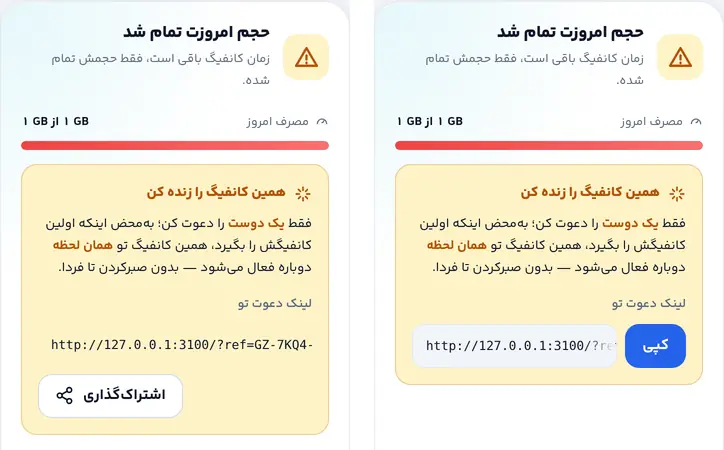
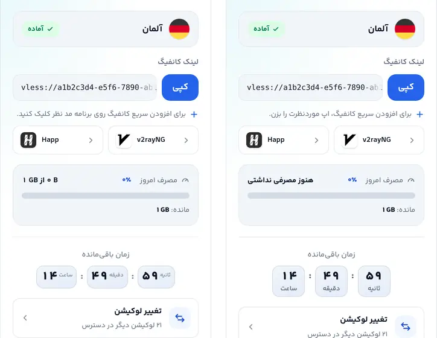
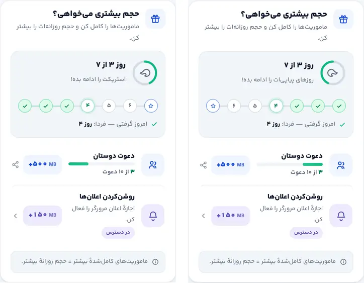
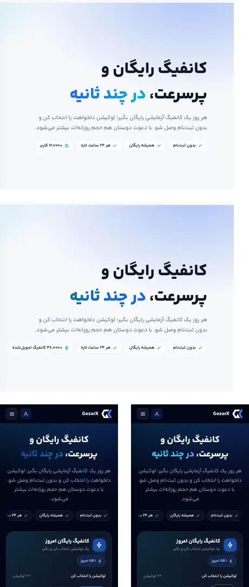
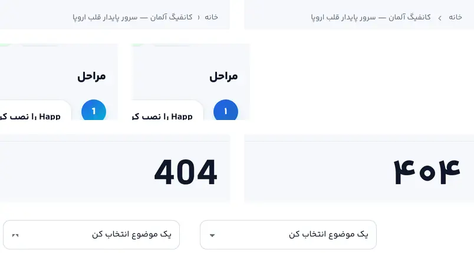
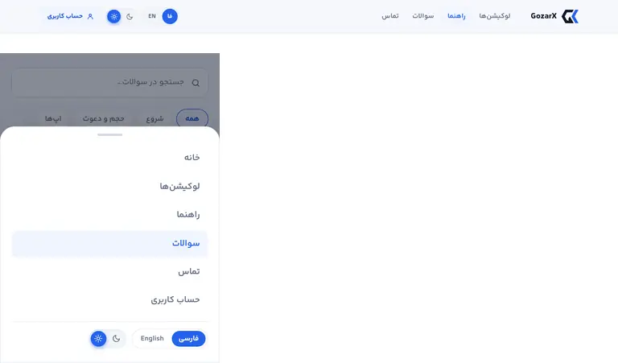

# فاز A — گزارش اجرا

فاز A پلن [`05-fix-plan.md`](05-fix-plan.md) («چیزهای شکسته» و بردهای سریع) اجرا شد. سنجش با همان
ابزار ممیزی انجام شد: `mockapi.py` + `audit.py` (۹۱ رندر) + `probe_extra.py`. هر معیار پذیرش یک عدد
دارد، و «قبل» و «بعد» با یک اسکریپت روی یک ماشین اندازه گرفته شده‌اند.

## نتیجهٔ سنجش

| معیار | قبل | بعد |
|---|---|---|
| خطای کنتراست متن روی زمینهٔ ساده (۹۱ رندر) | ۱۲ | **۰** |
| کنتراست متن روی گرادیان (محاسبهٔ دستی، بدترین نقطه) — دکمهٔ دریافت/ارسال و نشان قدم‌ها، روشن | ۳٫۷۲ | **۴٫۶۹** (hover) / ۵٫۱۷ |
| کنتراست تیتر گرادیانی هیرو، روشن / تاریک | ۲٫۲۸ / ۲٫۳۱ | **۴٫۳۷ / ۶٫۸۹** (متن درشت؛ کف ۳) |
| رقم لاتین در متن فارسی (به‌جز نام‌های فنی) | ۵ | **۰** |
| بخش‌های نامرئی زیر reduced-motion (`stillHiddenReveals`) | ۱۶ | **۰** |
| اسکلتون بارگذاری ویجت | نامرئی | **دیده می‌شود** |
| لینک دعوت در حالت S6 | بیرون‌زده، بدون قاب | **داخل `CopyField` با دکمهٔ کپی** |
| CLS موبایل: خانه / حساب / لندینگ | ۰ / ۰٫۰۰۵۲ / ۰ | ۰ / ۰٫۰۰۵۲ / ۰ (بدون تغییر) |
| تعداد Tab تا دکمهٔ دریافت، موبایل / دسکتاپ | ۲۷ / ۳۲ | ۲۷ / ۳۲ |
| سرریز افقی | ۰ | ۰ |

دربارهٔ عدد ۱۶: پروب قدیمی بخش‌های نامرئی را **بعد** از اینکه خودش آن‌ها را نمایان کرده بود
می‌شمرد، پس همیشه ۰ برمی‌گرداند. حالا `settle()` قبل از نمایان‌کردن می‌شمارد. برای اطمینان از اینکه
پروب واقعاً خطا را می‌گیرد، همان قاعدهٔ تکراری حذف‌شده را به صفحهٔ فعلی تزریق کردیم و شمارش به ۱۶
رسید. بدون آن قاعده، شمارش ۰ است.

## کارهای انجام‌شده، به تفکیک یافته

| شناسه | کار | فایل |
|---|---|---|
| C-57 | `--skel-1/--skel-2` (و `--accent`) در هر چهار بلوک تم. قاعدهٔ «هر توکن در هر چهار بلوک» بالای بلوک‌ها نوشته شد | `globals.css` |
| V-12 | قاعدهٔ تکراری `#app.reveal-js .reveal` حذف شد تا override کاهش حرکت برنده باشد | `globals.css` |
| V-02 | `ReviveBlock` از همان `CopyField` لینک کانفیگ استفاده می‌کند. دکمهٔ «اشتراک‌گذاری» تمام‌عرض فقط وقتی `navigator.share` وجود دارد نمایش داده می‌شود | `ClaimWidget.tsx` |
| C-48 | شمارنده با کلاس `.cd-seg` (نه `.seg` هدر)؛ برچسب زیر عدد، ۱۱px، رنگ `--muted`؛ حروف بزرگ و letter-spacing فقط برای برچسب لاتین؛ ارقام با `faDigits`. `InlineCountdown` که استفاده نمی‌شد حذف شد | `pieces.tsx`، `globals.css` |
| V-07، C-18 | placeholder کد انتقال با فونت متن و بدون letter-spacing. انقضا با ارقام فارسی («زمان باقی‌مانده: ۹:۵۸»). شکست ساخت کد حالا پیام `role="alert"` دارد | `TransferCard.tsx`، `globals.css` |
| C-49 | جداکنندهٔ breadcrumb به‌جای کاراکتر `‹` آیکون `chevr` با `ic-dir` است. در هر دو زبان رو به جلو است (با پیکسل سنجیده شد) | `l/[slug]/page.tsx` |
| C-45، C-46، V-14k | `dir="ltr"` از ریل روزهای پیاپی حذف شد (روز ۱ در شروع خط). نوار دعوت و نوار مصرف از inline-start پر می‌شوند و گرادیانشان هم در RTL برعکس شد. حلقه در RTL پادساعتگرد است | `AccountRewards.tsx`، `globals.css` |
| C-31، C-50 | ارقام فارسی برای شمارهٔ قدم راهنما و «۴۰۴». `faDigits` تکراری `HomeStats` حذف شد. `faDigits` مشترک حالا ممیز و جداکنندهٔ هزارگان بین دو رقم را هم بومی می‌کند («۱٫۵»، «۱۲٬۰۰۰») | `i18n.ts`، `guides/[platform]`، `not-found.tsx`، `HomeStats.tsx` |
| V-05، V-06، 04-probes §۳ | `--faint` برای متن کنار گذاشته شد (antibot، `.hint`، `.opt`، deflect صفحهٔ درباره ← `--muted`). گرادیان متن تیتر با `--grad-a/--grad-b` جدا شد. سر دور گرادیان‌های حامل متن سفید `--cta-end` (فیروزه‌ای ۷۰۰) است | `globals.css`، `about/page.tsx` |
| C-51، C-52 (D2) | چیپ «هر {h} ساعت تازه» از `trial_hours` در `/config` پر می‌شود (فیلد تازه در بک‌اند با تست). «+{n} کانفیگ تحویل‌شده» شمار واقعی `/stats` است که به هزار رو به پایین گرد می‌شود؛ زیر ۱۰۰۰ یا بدون داده، چیپ پنهان است. آیکون از «کاربران» به «صاعقه» تغییر کرد. هر دو سمت سرور خوانده می‌شوند (`lib/publicData`) و هرگز از `/status`. جواب‌های FAQ هم دیگر عدد ندارند | `status.py`، `page.tsx`، `publicData.ts`، `seed_faq.py`، `content.ts` |
| C-22، C-24 | `aria-current="page"` و `.active` در ناوبری دسکتاپ، منوی موبایل و چیپ حساب. همبرگر «باز کردن منو» با `aria-controls` است و منو «منوی سایت» نام دارد. برچسب زبان فوتر هم فارسی شد | `Header.tsx`، `Footer.tsx` |
| C-05، V-04 | ماموریت‌ها مبلغ واقعی را نشان می‌دهند («+۵۰۰ MB») و متنشان راست‌چین است. toast جمله‌ای واقعی است (افزوده‌شد با مبلغ / قبلاً گرفته‌ای / ثبت نشد). منطقهٔ `role="status"` همیشه mount است | `Missions.tsx`، `AccountRewards.tsx`، `rewards.ts` |
| C-53..C-55، V-14i/j | «کلیک کنید»← «بزن»؛ «کانفیگ شما»← «کانفیگت»؛ «استریک»← «روزهای پیاپی»؛ «آپ‌تایم»← «پایداری سرویس»؛ «بدون ردگیری تبلیغاتی»؛ ارجاع FAQ به بخش ناموجود «حجم بیشتر» حذف شد. وعدهٔ QR ماند، چون طبق D5 ساخته می‌شود | `design-copy.ts`، `seed_faq.py` |
| V-14a..c | فلش `select` در RTL درست شد؛ مصرف صفر زنده ← «هنوز مصرفی نداشتی»؛ دکمهٔ در حال کار با opacity کامل و `aria-busy` | `globals.css`، `ClaimWidget.tsx`، `pieces.tsx` |

## انحراف‌ها از پلن و چیزهایی که حین سنجش پیدا شد

- **C-18 کامل در همین فاز بسته شد**، هم خطای ساخت کد و هم ارقام انقضا (در پلن فقط نیمهٔ بصری آن بود).
- **C-06 / V-13 تا نیمه جلو آمد**، چون همین خطوط ماموریت ویرایش می‌شدند. چیپ اعلان دیگر نمایش داده
  نمی‌شود وقتی: اعلان روشن است، کاربر آن را مسدود کرده، یا مرورگر `PushManager` ندارد (Safari آیفون
  بیرون از وب‌اپ نصب‌شده؛ آن‌جا دکمه‌ای بود که فقط شکست می‌خورد). راهنمای «اول به صفحهٔ اصلی اضافه کن»
  و ماندگاری بستن نوار در فاز B می‌مانند.
- **V-14d (نشان «محبوب») هم بسته شد.** قاعده‌ای که نشان را در حالت انتخاب پنهان می‌کرد حذف شد. سنجش
  نشان داد نشان و تیک روی هر کارت کم‌عرض‌تر از حدود ۱۵۰px روی هم می‌افتند (۱۳۵px² در ۳۶۰، ۳۹۰ و
  ویجت ۹۰px دسکتاپ). به همین دلیل روی کارت محبوب تیک پنهان است و نشان می‌ماند؛ حالت انتخاب از قاب،
  رنگ و حلقه خوانده می‌شود. برخورد بعد از اصلاح در هر چهار عرض ۰ است.
- **V-14b «هنوز مصرفی نداشتی» فقط برای صفرِ زنده** نمایش داده می‌شود. وقتی پنل در دسترس نیست
  `usage_bytes` هم ۰ است، اما آن «نمی‌دانیم» است، نه «مصرف نکردی».
- **پسرفت CLS که خود این فاز ساخت، پیدا و بسته شد.** وقتی اسکلتون رنگ گرفت، Chromium جابه‌جایی آن را
  هم شمرد، و React گره‌های `div` اسکلتون را در ویجت نهایی بازیافت می‌کرد (placeholder شبکه همان
  `.cta-anchor` می‌شد). نتیجه CLS ۰٫۱۳ روی موبایل بود. با یک `key` روی شاخهٔ بارگذاری، ویجت جایگزین
  می‌شود و بازیافت نمی‌شود؛ CLS به همان عدد قبل برگشت.
- **داده‌های سرور زنده هم باید عوض می‌شدند.** `add_default` فقط ردیف غایب را درج می‌کند، پس جواب‌های
  قدیمی FAQ («هر ۲۴ ساعت…») روی سرور می‌ماندند. مهاجرت `a42488f9321a` فقط ردیف‌هایی را عوض می‌کند که
  هنوز **دقیقاً** متن پیش‌فرض قدیمی را دارند. همین مهاجرت ردیف‌های `site_copy_trust3/4` را که با متن
  پیش‌فرض قدیمی ذخیره شده باشند خالی می‌کند («از متن سایت استفاده کن»). ویرایش اپراتور دست نمی‌خورد. این
  رفتار روی یک پایگاه آزمایشی با ردیف ویرایش‌شده و ویرایش‌نشده، هم در upgrade و هم در downgrade، امتحان
  شد.
- «استریک» فقط در چند کلید `design-copy` مانده که هیچ‌جا رندر نمی‌شوند. پاک‌سازی کلیدهای بی‌مصرف
  همان C-56 است.
- **ناپایداری شناخته‌شدهٔ پروب:** حلقهٔ فوکوس روی اولین توقف Tab (لوگو) گاهی ۰px خوانده می‌شود، چون
  پروب مقدار را وسط یک transition ۰٫۰۱ms می‌خواند (۱ بار از ۴ اجرا). ۲۵۰ms بعد حلقه ۲px است. این
  پسرفت نیست.

## شاهدها (قبل ← بعد)

| | |
|---|---|
|  | اسکلتون بارگذاری: خالی ← دیده می‌شود |
|  | S6: لینک دعوت بیرون‌زده ← داخل قاب با دکمهٔ کپی |
|  | S5: برچسب شمارنده کنار عدد ← زیر عدد؛ ماموریت بی‌مبلغ ← «+۵۰۰ MB» |
|  | S3: «۰ B از ۱ GB» ← «هنوز مصرفی نداشتی»؛ «کلیک کنید» ← «بزن» |
|  | روزهای پیاپی: روز ۱ در چپ ← در شروع خط؛ نوار دعوت از لبهٔ درست |
|  | هیرو (دسکتاپ قبل/بعد، سپس موبایل تاریک): «+۱۲٬۰۰۰ کاربر» ← «+۴۸٬۰۰۰ کانفیگ تحویل‌شده» (عدد mock)؛ گرادیان تیتر در هر دو تم خوانا |
|  | breadcrumb رو به جلو؛ شمارهٔ قدم و «۴۰۴» فارسی؛ فلش `select` سالم |
|  | صفحهٔ فعال در هدر دسکتاپ و منوی موبایل |
|  | نشان «محبوب» روی کارت پیش‌فرض دیده می‌شود |

## استقرار

مهاجرت هنگام بالا آمدن اپ خودکار اجرا می‌شود (`alembic upgrade head`)، پس فرمان‌های معمول
استقرار (CLAUDE.md) کافی است. کش محتوا و ISR سایت حداکثر پنج دقیقه بعد متن تازه را نشان می‌دهند.
