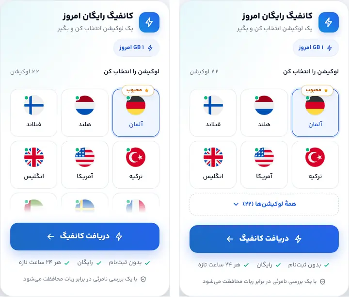
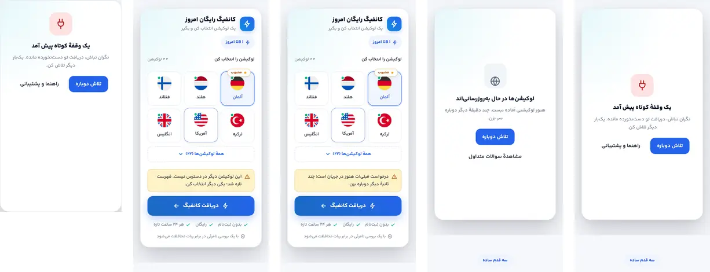
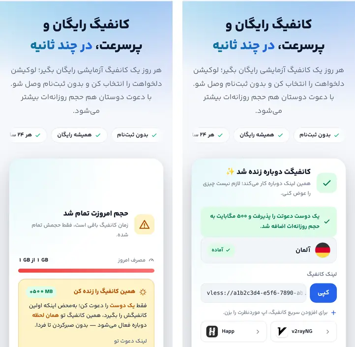
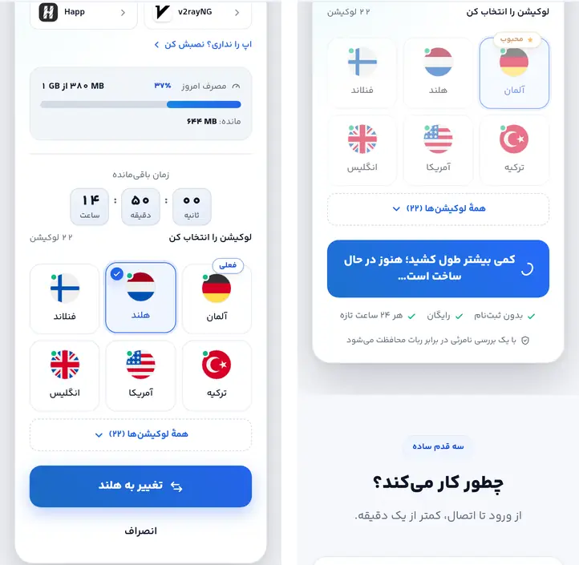
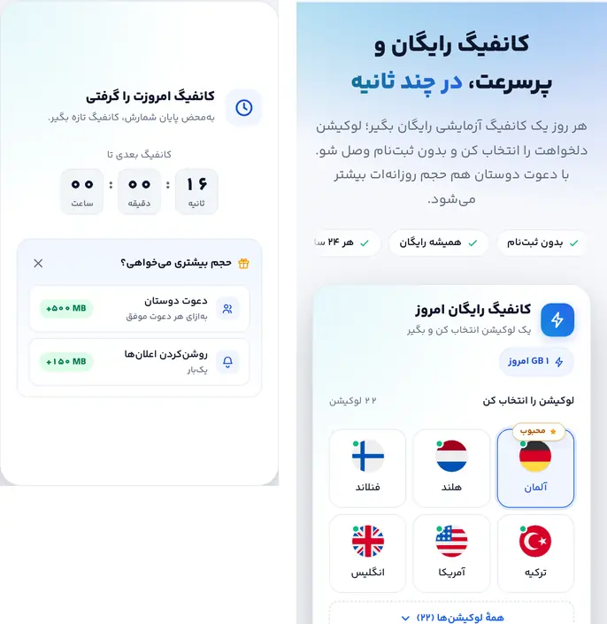
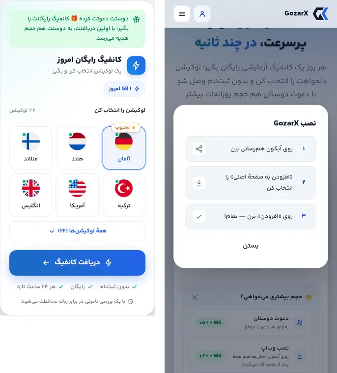

# فاز B — گزارش اجرا: درستی جریان دریافت در طول زمان

فاز B پلن [`05-fix-plan.md`](05-fix-plan.md) انجام شد. این فاز رفتاری را درست می‌کند که در **زمان**
معنا دارد: شمارنده‌ای که باید به صفر برسد و ادامه دهد، کانفیگی که دوستِ کاربر احیایش می‌کند، و
دریافتی که کند است یا دو بار زده شده. این چیزها در عکس دیده نمی‌شوند. برای همین کنار `audit.py`
یک اسکریپت پذیرش تازه ساخته شد: [`accept_b.py`](accept_b.py). این اسکریپت سایت build‌شده را روی
`mockapi.py` در زمان واقعی اجرا و بررسی می‌کند.

## نتیجهٔ پذیرش (`accept_b.py`: ۱۵ از ۱۵، در دو اجرای پشت‌سرهم)

| معیار پذیرش پلن | نتیجه |
|---|---|
| هر نتیجهٔ `mock_claim` حالت اختصاصی خودش را نشان دهد | **۸ از ۸**: هفت نتیجه، به‌علاوهٔ `rate_limited_once` که تلاش خودکار را می‌سنجد |
| `mock_state=cooldown0` ظرف ≤۶۰ ثانیه به S1 برگردد | **۱۹٫۷ ثانیه** (پنجرهٔ ۲۰ ثانیه‌ای mock)، و به صفحه‌خوان اعلام شد |
| S6 با تغییر وضعیت به `active` بدون رفرش جشن بگیرد | **۲۴٫۳ ثانیه** (یک دور polling ۲۵ ثانیه‌ای) با متن «یک دوست دعوتت را پذیرفت و ۵۰۰ مگابایت…» |
| Tab تا CTA ≤۱۲ | **۷** (قبل: ۲۷)؛ روی دسکتاپ ۱۲ (قبل: ۳۲) |
| (افزوده) انتخابگر یک توقف Tab؛ فلش انتخاب را جابه‌جا می‌کند؛ End بقیه را باز می‌کند | پاس |
| (افزوده) تغییر لوکیشن: بدون انتخاب غیرفعال، «تغییر به …»، بدون ردیف اطمینان‌بخشی، کامل می‌شود | پاس |
| (افزوده) پیش از توکن Turnstile، دکمه «در حال بررسی امنیتی…» است | پاس |
| (افزوده) دریافت کند بعد از ۳ ثانیه می‌گوید «کمی بیشتر طول کشید…» و opacity کامل دارد | پاس |

**پسرفت:** در کل ۹۱ رندر `audit.py`: خطای کنتراست ۰، سرریز ۰، رقم لاتین ۰. CLS در همهٔ صفحه‌ها
دقیقاً مثل فاز A ماند. وزن صفحهٔ اول حدود ۱۳ کیلوبایت (غیرفشرده) بیشتر شد که هزینهٔ منطق تازهٔ ویجت است.

## کارها، به تفکیک یافته

| شناسه | کار |
|---|---|
| C-01 | **نگاشت دلیل به حالت.** فقط `panel_error` و 5xx به S8 می‌روند. `not_ready` و `no_locations` حالت S7 با «تلاش دوباره» دارند. `location_unavailable` و `turnstile_failed` روی S1 می‌مانند و پیام درجا (`data-notice`) می‌گیرند. 429 (تقریباً همیشه قفل single-flight خود ما: دو بار زدن یا تب دوم) یک تلاش خودکار بعد از ۱٫۵ ثانیه دارد؛ اگر آن هم رد شد، وضعیت دوباره خوانده می‌شود (شاید تب دیگر موفق شده باشد) و پیام درجا نشان داده می‌شود. |
| C-02 | تا رسیدن توکن Turnstile، دکمه «در حال بررسی امنیتی…» است، با اسپینر و `aria-busy`. |
| C-03 | **بک‌اند:** `cooldown_until` و `expires_at` (ISO با آفست صریح UTC) به `/status` و `/claim` اضافه شد، همراه با `server_time`. فیلدهای قدیمی ماندند. **کلاینت:** `lib/time.clientDeadline` تا همان لحظه می‌شمارد و اختلاف ساعت گوشی با سرور را کم می‌کند. در صفر، `useBackoffPoll` وضعیت را می‌پرسد (فوری، سپس ۲، ۴، ۸، ۱۵ و ۳۰ ثانیه) تا نتیجه برسد. |
| C-04 | S6 هر ۲۵ ثانیه، و فقط وقتی تب دیده می‌شود، وضعیت را می‌پرسد (`useVisiblePoll`)؛ لحظهٔ دیده‌شدن تب هم یک بار می‌پرسد. وقتی کانفیگ از «حجم تمام» به «زنده» برگردد، حالت «کانفیگت دوباره زنده شد ✨» نمایش داده می‌شود. علت از رشد `referral_count` تشخیص داده می‌شود (دوست یا جایزهٔ دیگر) و مبلغ از رشد سقف روزانه. مبلغ جایزهٔ دعوت کنار عنوان بلوک revive آمد. |
| V-03 | در حالت «تغییر لوکیشن»، لوکیشن فعلی اول است و برچسب «فعلی» دارد. دکمه تا انتخاب یک لوکیشن دیگر غیرفعال است و بعد «تغییر به {لوکیشن}» می‌شود. «انصراف» اضافه شد و ردیف‌های اطمینان‌بخشی حذف شدند. |
| C-60 | حالت‌های کوتاه (S5، S6، S7 و S8) در ارتفاع رزرو، عمودی وسط‌چین شدند. S1 دو ردیفه دقیقاً هم‌قد رزرو است (۶۰۹ در برابر ۶۱۰ پیکسل روی موبایل، ۵۶۲ در برابر ۵۶۲ روی دسکتاپ)، پس رزرو دست نخورد. |
| C-06، C-07، V-13 | بستن نوار ماموریت‌ها تا نیمه‌شب محلی در `localStorage` می‌ماند (با try/catch). روی آیفونی که وب‌اپ را نصب نکرده، چیپ «نصب وب‌اپ» با توضیح «روی آیفون اعلان‌ها هم فقط بعد از نصب کار می‌کنند» نمایش داده می‌شود و مراحل «افزودن به صفحهٔ اصلی» را باز می‌کند. چیپ اعلان آن‌جا پنهان است. |
| C-08 | دکمه‌های اپ بر اساس سیستم‌عامل واقعی‌اند: ویندوز و لینوکس فقط Happ؛ مک Happ و Streisand؛ ChromeOS مثل اندروید. زیر دکمه‌ها لینک «اپ را نداری؟ نصبش کن» به راهنمای همان پلتفرم آمده است. |
| C-10، C-11 | انتخابگر یک radiogroup واقعی است: یک توقف Tab، فلش‌ها (در RTL برعکس) انتخاب را جابه‌جا می‌کنند و Home و End کار می‌کنند. به‌جای اسکرول تو‌در‌تو، دو ردیف و دکمهٔ «همهٔ لوکیشن‌ها (N)» نمایش داده می‌شود؛ رفتن با فلش از ردیف دوم جلوتر بقیه را باز می‌کند. لوکیشن پیش‌انتخاب لندینگ و لوکیشن محبوب همیشه در دو ردیف اول‌اند. |
| C-12، C-13 | عنوان هر حالت `<h2>` است. بعد از یک دریافت، فوکوس روی عنوان نتیجه می‌رود. تغییرهایی که کسی دکمه‌ای برایشان نزده (پایان خنک‌سازی، احیا) از یک `role="status"` اعلام می‌شوند که بیرون از ریشهٔ حالت‌ها ثابت mount است. بعد از ۳ ثانیه برچسب «کمی بیشتر طول کشید؛ هنوز در حال ساخت است…» نمایش داده می‌شود. |
| C-14 | اشتراک دعوت جمله هم دارد («کانفیگ رایگان روزانه، بدون ثبت‌نام 🎁 با لینک من بگیر:»). کسی که با `?ref=` بیاید و هنوز کانفیگی نگرفته باشد، نوار خوشامد می‌بیند؛ با لینک خودش این نوار نمایش داده نمی‌شود. |

## تصمیم‌ها و چیزهایی که حین کار پیدا شد

- **ISO به‌تنهایی کافی نبود.** شمردن تا یک لحظهٔ مطلق با ساعت گوشی، روی گوشی‌ای که ساعتش غلط است
  (FAQ خودش می‌گوید «زمان دستگاه را چک کن») به همان اندازه خطا دارد. برای همین `server_time` هم
  فرستاده می‌شود و اختلاف دو ساعت هنگام دریافت پاسخ کم می‌شود.
- **polling بی‌صداست.** یک درخواست ناموفق در پس‌زمینه دیگر ویجت را وسط شمارش به صفحهٔ خطا نمی‌برد
  (`reload({ quiet: true })`)؛ درخواست بعدی دوباره تلاش می‌کند.
- **Turnstile در هر رندر دوباره ساخته می‌شد.** callback خطا به‌صورت arrow درون‌خطی پاس داده می‌شد و
  `<Turnstile>` با هر تغییر identity آن، ویجت Cloudflare را از نو می‌ساخت. این باگ پیش از فاز B
  هم وجود داشت و اینجا با `useCallback` بسته شد.
- **در بررسی فوکوس، فلش کیبورد اول با تأخیر یک فریم فوکوس را جابه‌جا می‌کرد.** برای یک لحظه
  «انتخاب‌شده» و «فوکوس‌خورده» با هم فرق داشتند. حالا کارت دیده‌شده فوراً فوکوس می‌گیرد.
- **بک‌اند:** `AlreadyClaimedToday.until` اختیاری است (ربات تلگرام دست نخورد)، به‌علاوهٔ
  `Delivered.expires_at` و `trial.iso_utc` (رشتهٔ naive پنل را UTC می‌خواند، نه ساعت محلی بیننده).
  ۸ تست تازه اضافه شد. مهاجرت ندارد.
- **ابزار:** `mockapi.py` حالا زمان واقعی دارد (`cooldown` و `cooldown0` خودشان تمام می‌شوند)، تغییر
  کوکی `mock_state` وسط جلسه اعمال می‌شود (مسیر revive، همراه با اعتبار دعوت)، و این گزینه‌ها
  اضافه شدند: `mock_claim=rate_limited_once`، `mock_claim_ms`، `mock_turnstile=1` (کلید آزمایشی
  همیشه-موفق Cloudflare).

## شاهدها

| | |
|---|---|
|  | انتخابگر: اسکرول ۲۶۸px تو‌در‌تو ← دو ردیف و «همهٔ لوکیشن‌ها (۲۲)» |
|  | قبل: هر شکست همان «یک وقفهٔ کوتاه». بعد: لوکیشن ناموجود و درخواست تکراری درجا؛ «لوکیشن‌ها در حال به‌روزرسانی» با تلاش دوباره؛ فقط خطای پنل به S8 می‌رود |
|  | S6 ← «کانفیگت دوباره زنده شد ✨» با علت و مبلغ، بدون رفرش |
|  | «تغییر به هلند» با «فعلی» و «انصراف»؛ دریافت کند با برچسب صادقانه |
|  | شمارندهٔ خنک‌سازی به صفر می‌رسد و ویجت خودش به دریافت برمی‌گردد |
|  | نوار خوشامد دعوت؛ آیفون: نصب وب‌اپ راه اعلان‌هاست |

## استقرار

مهاجرت ندارد. بک‌اند و سایت با فرمان‌های معمول استقرار (CLAUDE.md) بالا می‌آیند. فیلدهای تازهٔ API
اختیاری‌اند، پس سایت قدیمی روی بک‌اند تازه و سایت تازه روی بک‌اند قدیمی (با fallback رشته‌ای) هر
دو کار می‌کنند.
