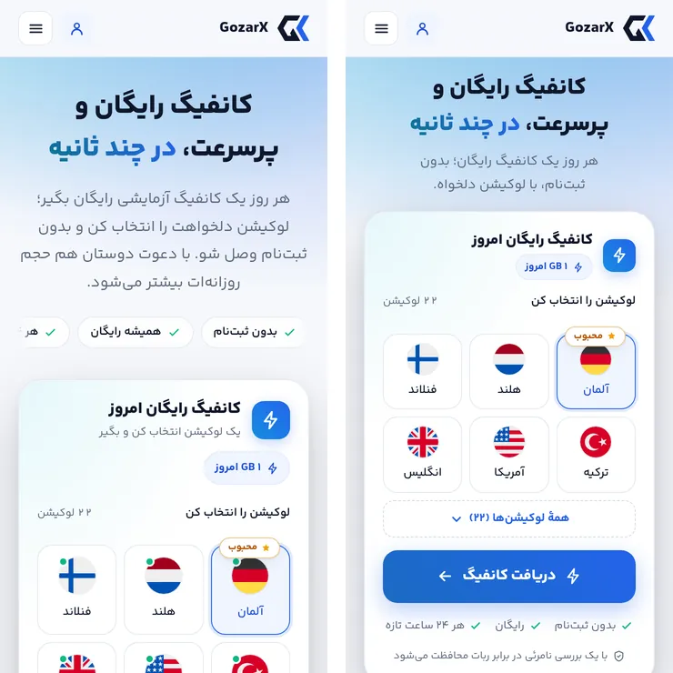
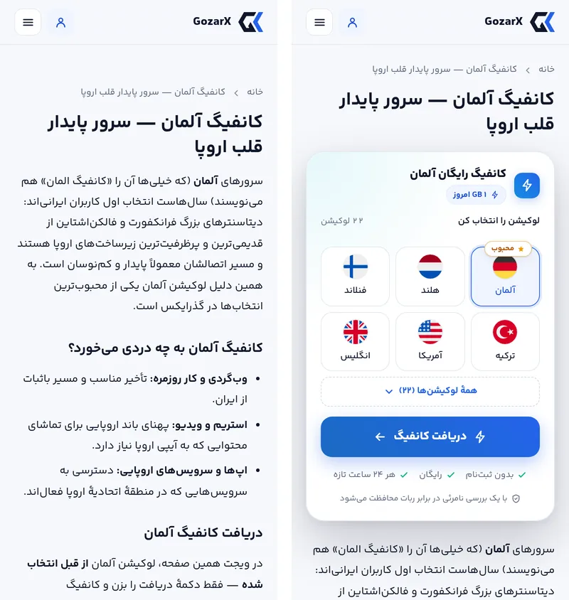
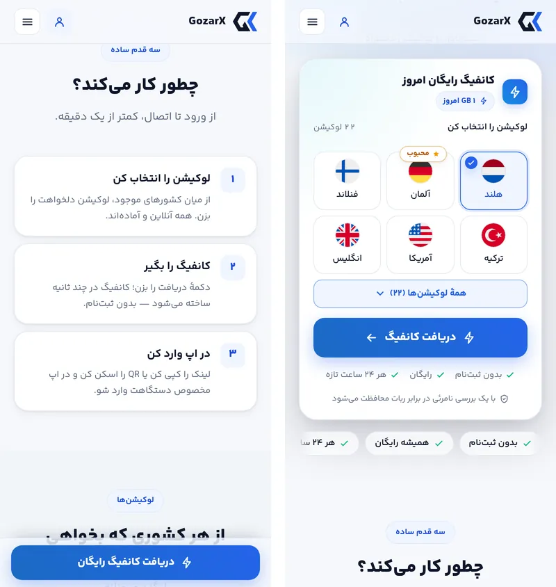
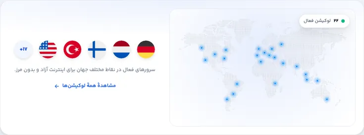
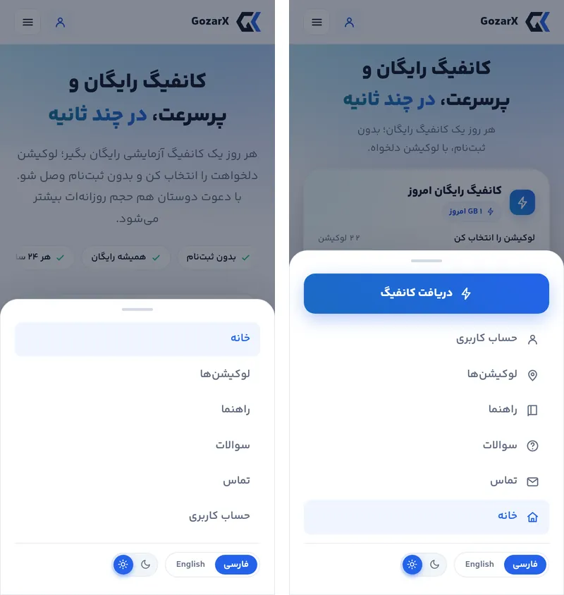
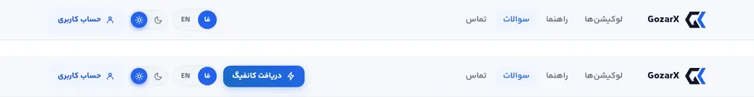
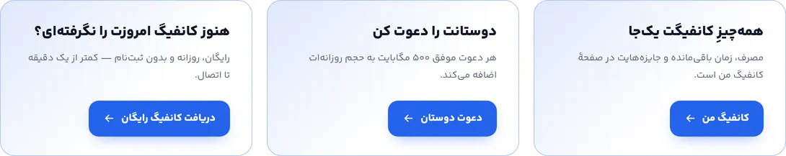
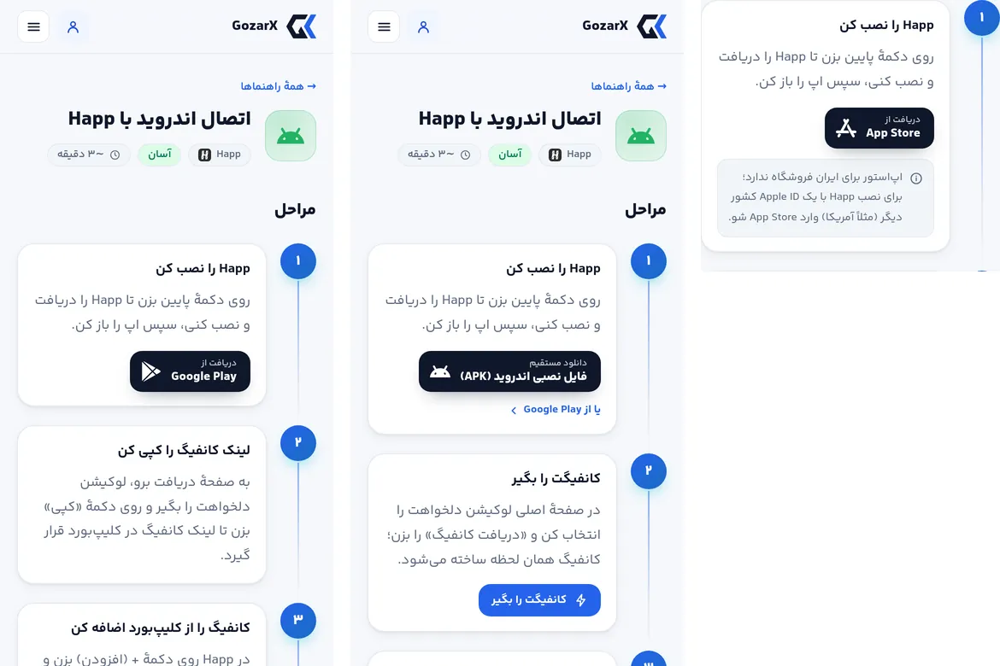
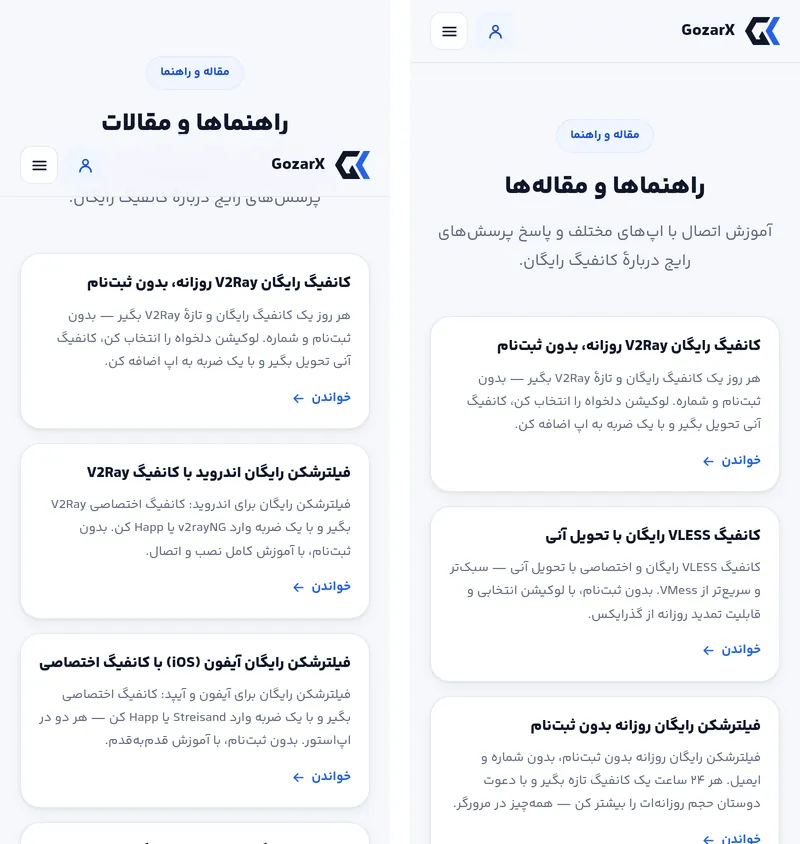

# فاز C — گزارش اجرا: تبدیل روی موبایل و مسیرهای ورود به ویجت

فاز C پلن [`05-fix-plan.md`](05-fix-plan.md) انجام شد. این فاز دو چیز را درست می‌کند: روی گوشی،
دکمهٔ «دریافت کانفیگ» باید در صفحهٔ اول باشد؛ و هر مسیری که به ویجت می‌رسد (لندینگ، صفحهٔ
لوکیشن‌ها، پرچم‌ها، هدر، منو، فوتر، ماموریت‌ها، کارت اپ‌ها، راهنماها) باید همان جایی برود که
می‌گوید و انتخاب کاربر را با خودش بیاورد. پذیرش با اسکریپت تازهٔ [`accept_c.py`](accept_c.py) روی
سایت build‌شده و `mockapi.py` سنجیده شد.

## نتیجهٔ پذیرش (`accept_c.py`: ۳۶ از ۳۶)

| معیار پذیرش پلن | قبل | بعد |
|---|---|---|
| `home-fa-fold-m360`: دکمه کامل در صفحهٔ اول (۳۶۰×۷۴۰) | ۱۹۷ پیکسل زیر فولد | پایین دکمه در y=۶۶۳ |
| `home-fa-fold-m390`: دکمه کامل در صفحهٔ اول (۳۹۰×۸۴۴) | ۹۳ پیکسل زیر فولد | پایین دکمه در y=۶۶۹ |
| `landing-germany-fa-fold-m390`: ویجت بالای فولد | بالای ویجت y≈۱۰۱۴ | بالای ویجت y=۲۱۳، پایین دکمه y=۶۴۳ |
| کلیک «هلند» در `/locations` ← «هلند» در خانه انتخاب‌شده | «آلمان» (محبوب) انتخاب‌شده | «هلند» انتخاب‌شده (`/?loc=هلند#hero-widget`) |

بررسی‌های افزوده (همه پاس): نسخهٔ انگلیسی در ۳۶۰ و ۳۹۰؛ پرچم صفحهٔ اول لوکیشنش را انتخاب می‌کند،
حتی بعد از یک انتخاب دستی؛ نوار چسبان فقط وقتی ویجت از دید خارج است دیده می‌شود، کنار نوار فوتر
کنار می‌رود، در خنک‌سازی و روی دسکتاپ نیست و به عنوان ویجت برمی‌گرداند (با فوکوس روی `<h2>`)؛
برای دارندهٔ کانفیگ «کانفیگ من» است؛ هدر و منوی موبایل؛ چهار حالت نوار فوتر؛ ردیف‌های حجم بیشتر؛
کارت اپ‌ها برای اندروید و iOS؛ راهنماهای اندروید و iOS؛ صفحهٔ `/articles` و sitemap؛ هیچ `{token}`
پرنشده‌ای در ۷ صفحه × ۲ زبان؛ متن مقالهٔ Hiddify؛ هر لنگر (`#hero-widget`، `#rewards`، `#claim` و
ضربه روی پرچم در دسکتاپ) زیر هدر چسبان می‌نشیند، نه پشت آن؛ و برابری ارتفاع رزرو با ارتفاع واقعی S1
در ۳۶۰، ۳۹۰ و ۱۲۸۰.

**پسرفت:** در هر ۹۱ رندر `audit.py`: خطای کنتراست ۰، سرریز ۰، رقم لاتین ۰ و بخش پنهان ۰، دقیقاً مثل
فاز B. CLS صفحهٔ اول و لندینگ در موبایل و دسکتاپ ۰ ماند (`/status` همان ۰٫۰۰۵ و ۰٫۰۰۳ قبلی).
[`accept_b.py`](accept_b.py) هنوز ۱۵ از ۱۵ است و Tab تا دکمه از ۷ به **۶** رسید (بخش «تصمیم‌ها» را
ببینید). وزن صفحهٔ اول (غیرفشرده): CSS حدود ۶٫۹ کیلوبایت، JS حدود ۵٫۳ و HTML حدود ۴٫۲ کیلوبایت بیشتر
شد؛ در عوض یک درخواست JSON کم شد، چون باند آمار دیگر `/stats` را دوباره از مرورگر نمی‌خواند.

## کارها، به تفکیک یافته

| شناسه | کار |
|---|---|
| V-01 | **هیروی موبایل.** زیر ۶۰۰ پیکسل زیرعنوان یکی‌دوخطی (`hero_sub_short`، قابل ویرایش در پنل کنار `hero_sub`) نمایش داده می‌شود و هر دو در HTML هستند، پس انتخاب با CSS است و به hydration وابسته نیست. تیتر کوچک‌تر و فاصله‌ها کمتر شد. چیپ‌های اعتماد در DOM **بعد از** ویجت آمدند و روی دسکتاپ، grid آن‌ها را زیر متن برمی‌گرداند. هدر ویجت تا ۴۶۰ پیکسل جمع‌وجور است (نشان ۳۶، سهمیه زیر عنوان، بدون زیرعنوان) و کارت‌ها و پرچم‌ها کوچک‌ترند. **نوار CTA چسبان** (`StickyCta`) فقط وقتی دیده می‌شود که ویجت در دید نیست. |
| C-26 | **لندینگ.** ویجت زیر H1 و بالای مقاله آمد، با عنوان «کانفیگ رایگان {لوکیشن}». همهٔ متن‌های seed از اول می‌گفتند ویجت «بالای همین صفحه» است، ولی ~۱۰۰۰ پیکسل پایین‌تر بود. انتهای مقاله یک نوار «کانفیگ رایگان آلمان را همین حالا بگیر» خواننده را به ویجت برمی‌گرداند. |
| C-27، V-11 | خانه‌های `/locations` بدون لندینگ به `/?loc=<نام>#hero-widget` می‌روند و `preselect` در ویجت همان لوکیشن را انتخاب می‌کند. پرچم‌های صفحهٔ اول هم لینک همین مسیرند و «+۱۷» به `/locations` می‌رود. `preselect` برای **هر مقدار یک بار** اعمال می‌شود: تازه‌شدن فهرست انتخاب دستی را پاک نمی‌کند، ولی لینک تازه (پرچم دوم در همان صفحه، بدون remount) بر آن غلبه می‌کند. کارت لوکیشن‌ها از ۹۰۰ پیکسل دوستونه است (نقشه کنار پرچم‌ها). |
| C-23، V-10 | دکمهٔ فشردهٔ «دریافت کانفیگ» در هدر دسکتاپ صفحه‌های بدون ویجت. منوی موبایل با دکمهٔ اصلی در بالا شروع می‌شود، آیکون دارد، صفحهٔ فعال را نشان می‌دهد و «خانه» (که لوگو هم به آن می‌رود) آخرین مورد است. |
| C-28..C-30 | **راهنماها.** دکمهٔ اول اندروید APK مستقیم از GitHub Release خود Happ است (تصمیم D4)، چون Google Play به IP ایران چیزی نمی‌دهد؛ Google Play لینک دوم است. در iOS و macOS توضیح داده شده که اپ‌استور برای ایران فروشگاه ندارد و Apple ID کشور دیگری لازم است. قدم ۲ «کانفیگت را بگیر» با لینک به ویجت است و قدم ۳ اول افزودن یک‌لمسی Happ را می‌گوید و بعد مسیر کلیپ‌بورد را. تصویر هر قدم با **گذاشتن فایل** اضافه می‌شود: `public/guides/<platform>/<n>.webp` (۱۶:۹) بدون تغییر کد زیر قدم n دیده می‌شود. هیچ تصویری فعلاً اضافه نشده، چون باید عکس واقعی از Happ روی هر پلتفرم باشد. |
| V-09 | **نوار فوتر وابسته به وضعیت.** بدون کانفیگ: «هنوز کانفیگ امروزت را نگرفته‌ای؟». دارندهٔ کانفیگ یا در حال خنک‌سازی: «دوستانت را دعوت کن» با مبلغ واقعی جایزه، به `/status#rewards`. رسیده به سقف دعوت: «همه‌چیزِ کانفیگت یک‌جا» به `/status`. نسخهٔ پیش‌فرض همانی است که در HTML سرور هست. |
| V-08 | صفحهٔ اول به‌جای ۱۳ قرص خاکستری، ۴ کارت منتخب (عنوان، توضیح متا، «خواندن») و «همهٔ مقاله‌ها» دارد. فوتر حداکثر ۵ لینک و «همهٔ مقاله‌ها» دارد. صفحهٔ تازهٔ **`/articles`** همهٔ مقاله‌ها را به زبان بیننده (اگر آن ردیف موجود باشد) فهرست می‌کند؛ breadcrumb JSON-LD دارد و در sitemap است. **مقالهٔ Hiddify اصلاح شد، حذف نشد**: جملهٔ «اگر مرحله‌به‌مرحله با تصویر می‌خواهی، راهنمای اتصال را باز کن» جایش را به این داد که راهنماها برای Happ نوشته شده‌اند. این تغییر در seed و با مهاجرت داده (`1d81a25d3ea5`) انجام شد. |
| C-37 | کارت Happ به راهنمای پلتفرم خود بیننده می‌رود، v2rayNG به `/l/v2rayng-config` و Streisand به `/l/streisand-config`. برچسب «Desktop» ترجمه شد و هر پلتفرم isolate جدا دارد. |
| C-38 | ردیف‌های «حجم بیشتر» لینک `/status#rewards` هستند (کارت جایزه‌ها `id="rewards"` گرفت، هم در اسکلتون و هم در کارت واقعی). مبلغی که بک‌اند نداده، به‌جای «—» نمایش داده نمی‌شود. باند آمار ارقام `/stats` را از رندر سرور می‌گیرد (همان درخواستی که چیپ هیرو می‌خواند) و خانهٔ بی‌داده را حذف می‌کند. |
| V-14e، g، h | نقطهٔ سبز «آنلاین» روی همهٔ کارت‌ها حذف شد، چون روی همه بود و دربارهٔ هیچ‌کدام چیزی نمی‌گفت. «چطور کار می‌کند» یک `<ol>` شماره‌دار با رقم فارسی است که روی گوشی به فهرست جمع‌وجور تبدیل می‌شود (سه کارت ۸۰۰ پیکسلی برای سه جمله بود). مقدمهٔ `/locations` راست‌چین شد. |

## تصمیم‌ها و چیزهایی که حین کار پیدا شد

- **پسرفت فاز B، پیدا شده با رندر و بسته شده در همان PR.** دکمهٔ «همهٔ لوکیشن‌ها ({n})» انتخابگر
  کلید `loc_all` را در لایهٔ i18n اضافه کرده بود. این لایه از `DESIGN_COPY` بالاتر است و `DESIGN_COPY`
  از قبل `loc_all` داشت: لینک «مشاهدهٔ همهٔ لوکیشن‌ها» صفحهٔ اول. در نتیجه آن لینک رشتهٔ ویجت را با
  توکن پرنشده نشان می‌داد. کلید ویجت به `loc_more_all` تغییر کرد. این اصلاح روی شاخهٔ فاز B
  (`e2204b2`، [PR #95](https://github.com/BoofKoor/GozarX/pull/95)) push شد، نه فقط اینجا. `accept_c.py`
  حالا متن رندرشدهٔ هر صفحه را برای `{token}` پرنشده می‌خواند و CLAUDE.md قاعدهٔ «کلید chrome هم‌نام
  کلید طراحی نباشد» را دارد.
- **`WidgetHead` بازنویسی‌های پنل را نمی‌دید.** این جزء `translator(locale)` خودش را بدون overrides
  می‌ساخت، پس `w_title` و `w_sub` ویرایش‌شده در پنل به ویجت نمی‌رسید. حالا عنوان و زیرعنوان
  resolve‌شده از والد می‌آیند. همین مسیر عنوان لندینگ را هم می‌برد.
- **ارتفاع رزرو دوباره اندازه‌گیری شد.** S1 جمع‌وجور ۵۲۰ پیکسل است (تا ۴۶۰)، بالاتر ۵۶۴، و زیر ۳۶۰
  پیکسل ۵۷۰ (خط‌های اطمینان‌بخشی زیر دکمه می‌شکنند). رزرو قبلی ۶۱۰ حالا ۹۰ پیکسل کارت خالی زیر دکمه
  می‌ساخت.
- **`overflow:hidden` هیرو، لنگر را پشت هدر می‌برد.** `hidden` هیرو را scroll container می‌کند و
  `scrollIntoView` حاشیهٔ `scroll-margin` هدف را در لبهٔ scroll container می‌بُرد. در دسکتاپ ویجت فقط
  ۲۸ پیکسل زیر لبهٔ هیرو است، پس `/?loc=…#hero-widget` و نوار چسبان آن را در y=۲۸ می‌گذاشتند و سرِ ویجت
  زیر هدر ۶۹ پیکسلی می‌ماند. `overflow:clip` همان برش را بدون scroll container انجام می‌دهد (`hidden`
  برای Safari زیر ۱۶ به‌عنوان جایگزین مانده). حالا ویجت در y=۸۴ می‌نشیند.
- **قاعدهٔ تکراری `.hero`.** قاعدهٔ `padding-block:28px 44px` پایین‌تر فایل در همهٔ عرض‌ها برنده بود و
  قاعدهٔ ۹۴۰ پیکسل هیچ‌وقت اعمال نمی‌شد. یکی شدند و مقدار مؤثر دسکتاپ حفظ شد، پس دسکتاپ تغییر
  دیداری ندارد.
- **ریل اسکرول‌شونده در Chromium یک توقف Tab است** (keyboard-focusable scrollers). جابه‌جایی ریل
  چیپ‌ها به زیر ویجت، Tab تا دکمه را از ۷ به ۶ رساند. ریل حلقهٔ فوکوس نداشت و حالا دارد (داخلی،
  چون mask لبه‌ها حلقهٔ بیرونی را محو می‌کرد).
- **زیرعنوان موبایل کلید خودش را دارد.** `site_hero_sub` ویرایش‌شده روی گوشی چهار خط است و همین دکمه
  را از صفحه بیرون می‌برد. پس گوشی `hero_sub_short` را نشان می‌دهد و این کلید در ویرایشگر کپی سایت
  کنار `hero_sub` قرار دارد.
- **نام «کانفیگ من»** روی نوار چسبان و نوار فوتر از همین حالا به کار رفت (تصمیم D1). تا فاز E
  چیپ هدر هنوز «حساب کاربری» است.
- **مهاجرت Hiddify** فقط ردیفی را تغییر می‌دهد که بدنه‌اش بایت‌به‌بایت همان seed است. محافظ این شرط
  md5 کل بدنه است، چون بدنه از اولین انتشار تغییر نکرده بود. روی یک پایگاه آزمایشی سنجیده شد: ردیف
  دست‌نخورده عوض و با downgrade برگردانده شد؛ ردیف ویرایش‌شده در هر دو جهت دست نخورد.
- **ابزار:** `mockapi.py` کوکی `mock_refs=cap` (سقف دعوت پر) گرفت. `accept_c.py` اضافه شد.

## شاهدها

| | |
|---|---|
|  | ۳۶۰×۷۴۰: چپ قبل (دکمه در صفحهٔ اول نیست)، راست بعد (دکمه و «همهٔ لوکیشن‌ها» در صفحهٔ اول) |
|  | لندینگ آلمان در ۳۹۰×۸۴۴: قبل مقاله، بعد ویجت «کانفیگ رایگان آلمان» با آلمان انتخاب‌شده |
|  | نوار چسبان روی «چطور کار می‌کند» شماره‌دار؛ ورود از `/locations` با «هلند» انتخاب‌شده |
|  | کارت لوکیشن‌های دسکتاپ: دوستونه، پرچم‌ها لینک‌اند |
|  | منوی موبایل: قبل فهرست متنی با «خانه» اول؛ بعد دکمهٔ اصلی، آیکون‌ها، صفحهٔ فعال |
|  | هدر دسکتاپ در `/faq`: بعد با «دریافت کانفیگ» |
|  | نوار فوتر در سه حالت: بدون کانفیگ، دارندهٔ کانفیگ (دعوت با مبلغ)، سقف دعوت پر |
|  | راهنمای اندروید قبل/بعد (APK اول، Google Play دوم، قدم ۲ با لینک)؛ نکتهٔ Apple ID در iOS |
|  | ۴ کارت مقاله در صفحهٔ اول؛ صفحهٔ `/articles` |

## استقرار

یک مهاجرت داده (`1d81a25d3ea5`: فقط متن مقالهٔ Hiddify). این مهاجرت با `alembic upgrade head` هنگام
بالا آمدن اجرا می‌شود و متغیر محیطی تازه‌ای لازم نیست. فرمان‌های استقرار همان‌های CLAUDE.md هستند.

## بیرون از این فاز (دیده شد، جایش فاز دیگری است)

- «GB ۱ امروز» روی چیپ سهمیه واژگون است (C-47، فرمت‌گر حجم فاز D).
- منوی موبایل تلهٔ فوکوس و قفل اسکرول ندارد (`menu-body-scroll-locked: visible`) و چند `link-more`
  حلقهٔ فوکوس ندارند (فاز D).
- قدم ۳ «چطور کار می‌کند» هنوز از QR می‌گوید؛ QR در فاز E ساخته می‌شود (تصمیم D5).
