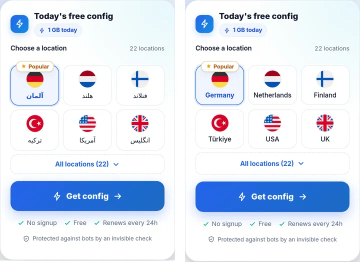
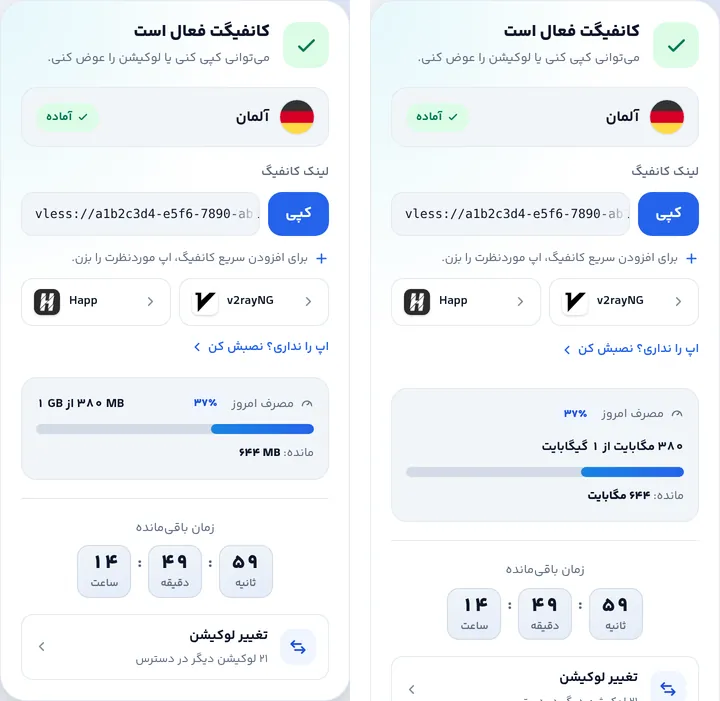
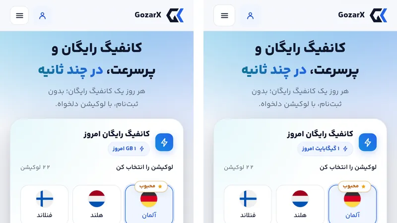
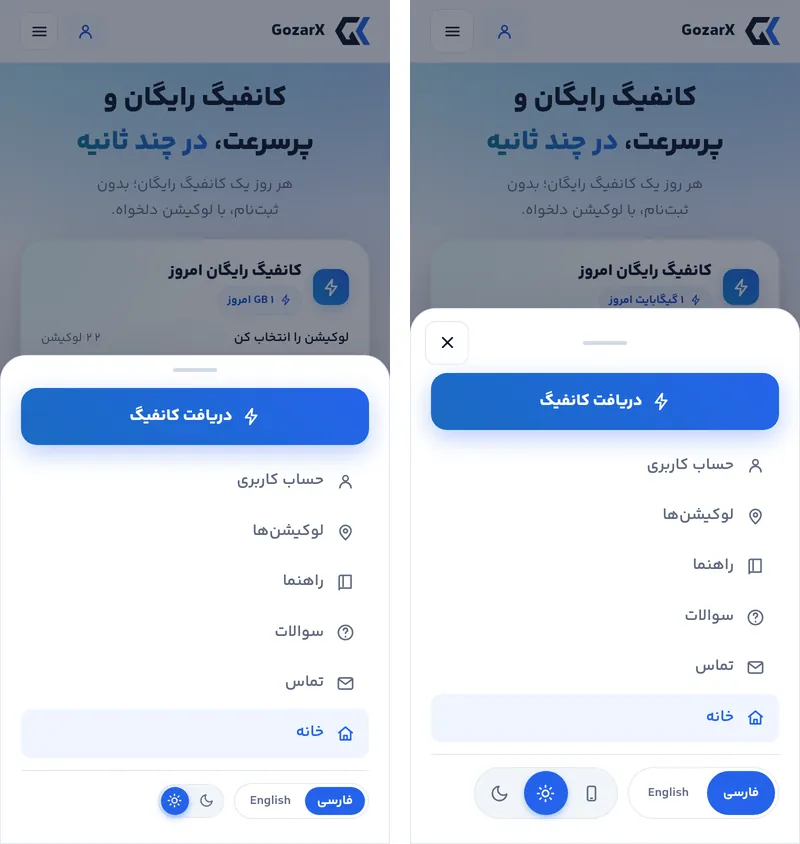
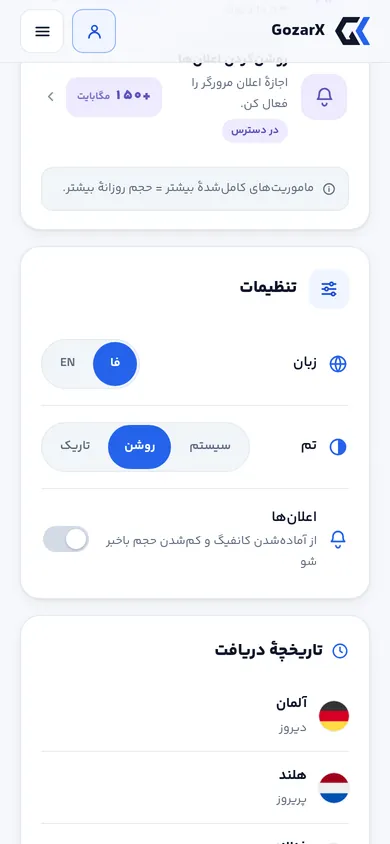
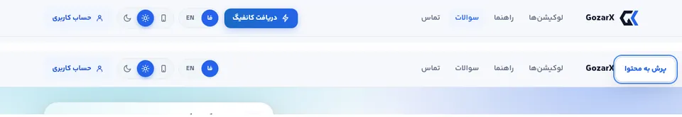
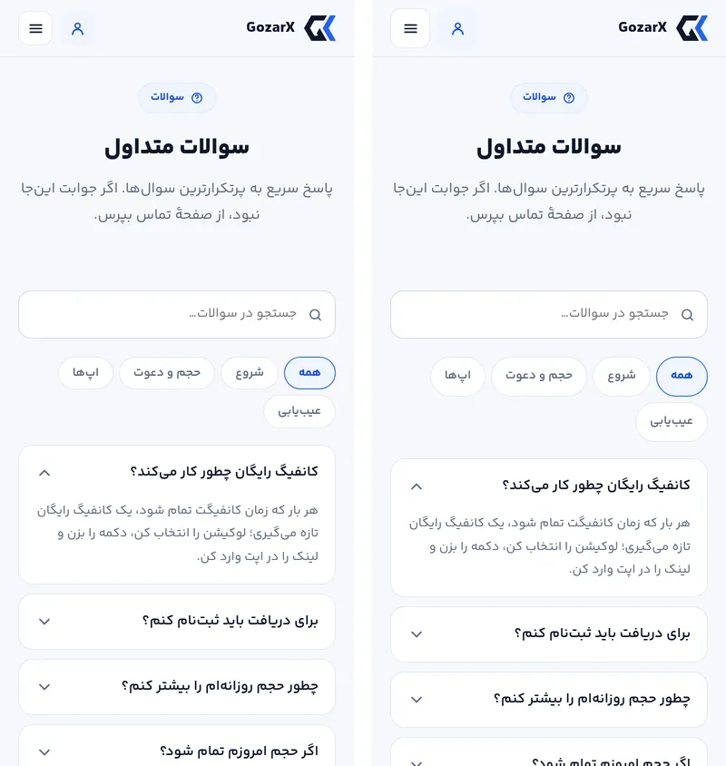

# فاز D — گزارش اجرا: زیرساخت دسترس‌پذیری و زبان

فاز D پلن [`05-fix-plan.md`](05-fix-plan.md) انجام شد. تغییرهای این فاز معمولاً در عکس دیده نمی‌شوند:
یک کاربر کیبورد در منو گیر می‌افتد یا از آن بیرون می‌افتد، انگشت روی دکمهٔ ۳۲ پیکسلی خطا می‌کند،
صفحه‌خوان «کپی شد» را نمی‌شنود، بازدیدکنندهٔ انگلیسی «آلمان» می‌خواند و «۱ GB» واژگون به «GB ۱» تبدیل
می‌شود. پذیرش با اسکریپت تازهٔ [`accept_d.py`](accept_d.py) روی سایت build‌شده و `mockapi.py` سنجیده شد.

## نتیجهٔ پذیرش (`accept_d.py`: ۱۲ از ۱۲)

| معیار پذیرش پلن | قبل | بعد |
|---|---|---|
| `tapUnder44` روی گوشی فقط لینک‌های درون‌متنی | ۵۸ کنترل زیر ۴۴ پیکسل (۱۷ صفحه و حالت، به‌علاوهٔ منو) | **۰** در ۳۶۰ و ۳۹۰، فارسی و انگلیسی |
| در منوی باز، Tab از منو بیرون نرود؛ `body{overflow:hidden}` | Tab به ویجت پشت منو می‌رفت؛ `overflow: visible` | ۲۴ بار Tab داخل منو ماند؛ `hidden`؛ با Esc فوکوس به دکمهٔ منو برمی‌گردد |
| UI انگلیسی «Germany» نشان دهد | «آلمان، هلند…» | Germany · Netherlands · Finland · Türkiye · USA · UK |
| هیچ «GB ۱» واژگون | چیپ سهمیه «GB ۱ امروز» | «۱ گیگابایت امروز»؛ «۳۸۰ مگابایت از ۱ گیگابایت»؛ انگلیسی "1 GB today" |

بررسی‌های افزوده (همه پاس):
- پنجرهٔ تأیید پاک‌کردن داده: نام دارد، فوکوس داخلش می‌رود، Tab داخل می‌ماند، صفحه قفل می‌شود و Esc فوکوس را به دکمهٔ خودش برمی‌گرداند.
- لینک «پرش به محتوا» اولین توقف Tab است و فوکوس را به `<main>` می‌برد.
- «کپی شد» در یک live region همیشه‌حاضر اعلام می‌شود.
- آکاردئون‌ها `aria-controls` واقعی دارند، سؤال داخل heading است و پاسخ بسته `hidden="until-found"` است.
- ساختار سرفصل ۹ صفحه دقیقاً یک H1 و بدون پرش سطح است.
- تم سه‌حالته: «تاریک» کوکی و ویژگی را می‌گذارد و «سیستم» هر دو را پاک می‌کند؛ کنترل هدر هم همراهش عوض می‌شود.

**پسرفت:**
- [`accept_c.py`](accept_c.py) ۳۶ از ۳۶ و [`accept_b.py`](accept_b.py) ۱۵ از ۱۵ است. در `accept_c` فقط بررسی منو به‌روز شد تا دکمهٔ بستن را کنار بگذارد.
- در هر ۹۱ رندر `audit.py`: خطای کنتراست ۰ (همان ۱۱ مثبت کاذب شناخته‌شدهٔ متن روی گرادیان)، سرریز ۰، رقم لاتین ۰ و بخش پنهان ۰.
- `tapUnder44` خود ممیزی در همهٔ رندرهای ۳۶۰ و ۳۹۰ خالی است.
- CLS تغییری نکرد: صفحهٔ اول و لندینگ ۰، `/status` همان ۰٫۰۰۵ و ۰٫۰۰۳.
- پروب منو: `menu-body-scroll-locked` از `visible` به `hidden` رسید.
- وزن صفحهٔ اول (غیرفشرده): CSS حدود ۲٫۵ کیلوبایت، JS حدود ۴٫۸ و HTML حدود ۱٫۹ کیلوبایت بیشتر شد.

**چیزی که فقط ممیزی کامل پیدا کرد:** بررسی ۴۴ پیکسلِ خود من فقط فارسی بود. `tapUnder44` خود ممیزی در
`home-en-light-m390` ده لینک ستون فوتر را ۴۲ پیکسل گزارش کرد، و در راهنمای انگلیسی هم دو `summary`
۴۲ پیکسلی بود. خط متن لاتین کوتاه‌تر از فارسی است، پس padding‌ای که فارسی را به ۴۴ می‌رساند انگلیسی را
نمی‌رساند. هر دو حالا `min-block-size` دارند و `accept_d.py` انگلیسی را هم می‌سنجد.

## کارها، به تفکیک یافته

| شناسه | کار |
|---|---|
| C-39، C-24 | **`lib/useFocusTrap`**: همان قرارداد پنل ادمین (Esc، ورود و بازگشت فوکوس، Tab داخل، قفل اسکرول صفحه) در یک جا. منوی موبایل، `Overlay` (راهنمای نصب iOS، پیش‌اعلان push، راهنمای مسدودی) و تأیید پاک‌کردن داده همه از آن استفاده می‌کنند. `onClose` از یک ref خوانده می‌شود، چون فراخواننده‌ها arrow درون‌خطی می‌دهند و effect وابسته به callback در هر رندر دوباره اجرا می‌شد. `Overlay` نام می‌گیرد (`<OverlayTitle>`، h2 با `aria-labelledby`). منو دکمهٔ بستن دارد. |
| C-40 | **هدف لمسی ۴۴px** در هر عرضی که منوی همبرگری دارد (زیر ۱۰۰۰px): دکمه‌های هدر، لوگو، لینک‌ها و زبان فوتر، «مشاهدهٔ همه»، «همهٔ لوکیشن‌ها»، سگمنت‌ها و سوییچ تنظیمات، کپی و «انتقال» شناسه، بستن ماموریت‌ها، تب‌های سوالات، breadcrumb، چیپ‌های مرتبط، `summary` عیب‌یابی و لینک‌های راهنما. جایی که ظاهر باید کوچک بماند (صفحهٔ کپی ۳۲px، ریل ۴۶×۲۶ سوییچ)، جعبهٔ ۴۴px شفاف است و ظاهر داخلش رسم می‌شود. جایی که نوار نباید بلندتر شود، margin منفی فضا را برمی‌گرداند. ارتفاع هدر عوض نشد (۶۳px). |
| C-41 | لینک «پرش به محتوا» (فقط هنگام فوکوس دیده می‌شود) و `<main id="main" tabIndex={-1}>`. |
| C-42 | کامپوننت `Announce` (live region همیشه‌حاضر) برای کپی لینک کانفیگ، کپی شناسه و کپی کد انتقال. خطای ارسال فرم تماس `role="alert"` دارد و بعد از ارسال موفق فوکوس به عنوان تأیید می‌رود (قبلاً دکمهٔ فوکوس‌خورده با فرم ناپدید می‌شد). |
| C-43 | `AccItem` مشترک برای تیزر صفحهٔ اول و `/faq`: دکمه داخل heading است، `aria-controls` و `aria-labelledby` دارد و پاسخ بسته `hidden="until-found"` است، پس Ctrl-F پیدایش می‌کند و `beforematch` بازش می‌کند. |
| C-44 | **`locLabel(remark, lang)`** کنار `locName` (کلید تطبیق): اگر remark به خط بیننده باشد، همان نمایش داده می‌شود؛ وگرنه نام کشور به زبان بیننده از `Intl.DisplayNames`، از طریق جدول کوتاه (USA، UK، UAE، «آمریکا»، «انگلیس»، «امارات»). شماره‌گذاری («آلمان ۲» ← "Germany 2") حفظ می‌شود و هر چیزی مشخص‌تر از یک کشور (شهر، برچسب) دست‌نخورده می‌ماند. نام کارت‌ها دوخطی می‌شود، نه ellipsis. این نام در انتخابگر، کارت کانفیگ، «تغییر به…»، `/locations`، پرچم‌های صفحهٔ اول، تاریخچهٔ حساب و عنوان ویجت لندینگ استفاده می‌شود. |
| C-47 | **`formatVolume(bytes, locale)`** در `lib/format`: ۱۰۲۴مبنا، یک رقم اعشار، ارقام محلی با «٫». در فارسی واحد واژهٔ فارسی است («گیگابایت») و در انگلیسی نماد ("GB"). جاهایی که عوض شدند: چیپ سهمیه، سنجهٔ مصرف و «مانده»، یادداشت احیا، مبلغ بلوک احیا، چیپ‌های ماموریت، کارت جایزه‌ها، toastها، نوار دعوت فوتر و کاشی‌های «حجم بیشتر». همه از **بایت** خوانده می‌شوند، نه رشتهٔ `human_bytes` بک‌اند. |
| C-19، C-25 | **تم سه‌حالته** (تصمیم D6) با «سیستم» اول. `lib/prefs` یک پیاده‌سازی برای تم (`useTheme` با `useSyncExternalStore`) و زبان (`useLocaleSwitch`) دارد. هدر، منو، فوتر و تنظیمات حساب همه از آن استفاده می‌کنند، پس با هم ناهمخوان نمی‌شوند. «سیستم» یعنی نبودِ انتخاب: نه کوکی و نه `data-theme`. |
| 04-probes §۶ | H1 صفحهٔ آفلاین؛ `h4` صفحهٔ تماس به `h2`؛ سرفصل‌های فوتر `h2`/`h3` (قبلاً `h3`/`h4` در همهٔ صفحه‌ها)؛ عنوان پنجره‌ها `h2`. |

## تصمیم‌ها و چیزهایی که حین کار پیدا شد

- **React 19.2 مقدار `hidden="until-found"` را به `hidden=""` تبدیل می‌کند.** پس `AccItem` این مقدار را
  بعد از hydration می‌گذارد. در رندر سرور، پاسخ بسته `hidden` معمولی است که همان رفتار قبل است.
  بدنهٔ آکاردئون دیگر `display:none` ندارد، چون همین قاعده پاسخ‌های بسته را از find-in-page پنهان می‌کرد.
- **فرم تماس هنوز callback درون‌خطی به `<Turnstile>` می‌داد.** این همان باگی است که فاز B در ویجت
  بست: با هر کلید در جعبهٔ پیام، چالش Cloudflare از نو ساخته می‌شد. با `useCallback` بسته شد.
- **رزرو ارتفاع ویجت دوباره سنجیده شد.** دکمهٔ ۴۴ پیکسلی «همهٔ لوکیشن‌ها» S1 را ۳px بلندتر کرد (۵۲۳
  تا ۴۶۰px). زیر ۳۶۰ دو پله شد: زیر ۳۵۰ خط اطمینان‌بخشی یک بار می‌شکند (۵۵۱) و زیر ۳۳۰ دو بار (۵۷۲).
  رزرو یکپارچهٔ ۵۷۰ قبلی در ۳۵۰ تا ۳۵۹ پیکسل ۴۷ پیکسل کارت خالی می‌ساخت.
- **علامت «+» در فارسی.** مبلغ‌ها («+۵۰۰ مگابایت») دیگر در `dir="ltr"` پیچیده نمی‌شوند، چون واحد فارسی
  است. در نتیجه «+» طبق ترتیب خواندن راست‌به‌چپ پیش از عدد می‌نشیند (سمت راستش).
- **Türkiye.** `Intl.DisplayNames` نام امروزی را می‌دهد، نه "Turkey".
- **تست فاز C به‌روز شد.** بررسی منوی `accept_c.py` حالا دکمهٔ بستن (که عمداً اول آمده) را کنار
  می‌گذارد و دنبال اولین اقدام منو است.

## شاهدها

| | |
|---|---|
|  | UI انگلیسی: قبل «آلمان، هلند…»، بعد Germany · Netherlands · Finland · Türkiye · USA · UK |
|  | کارت کانفیگ: قبل «۱ GB از ۳۸۰ MB» (جفت واژگون) و «۶۴۴ MB»، بعد «۳۸۰ مگابایت از ۱ گیگابایت» و «۶۴۴ مگابایت» |
|  | دکمه‌های ۴۴ پیکسلی هدر با همان ارتفاع هدر؛ چیپ «GB ۱ امروز» ← «۱ گیگابایت امروز» |
|  | منو: دکمهٔ بستن، تم سه‌حالته و زبان با هدف ۴۴ پیکسلی (Tab داخل منو می‌ماند) |
|  | تنظیمات حساب: «سیستم / روشن / تاریک»؛ سوییچ اعلان در جعبهٔ ۴۴ پیکسلی با همان ظاهر |
|  | هدر دسکتاپ با تم سه‌حالته؛ «پرش به محتوا» روی اولین Tab |
|  | سوالات: تب‌های ۴۴ پیکسلی، سؤال‌ها heading هستند و پاسخ‌های بسته با Ctrl-F پیدا می‌شوند |

## استقرار

فقط فرانت‌اند است: بدون مهاجرت و بدون متغیر محیطی تازه. کوکی `theme` همان است؛ «سیستم» فقط آن را پاک
می‌کند. فرمان‌های استقرار همان‌های CLAUDE.md هستند.
