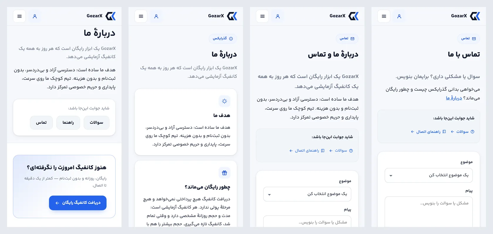
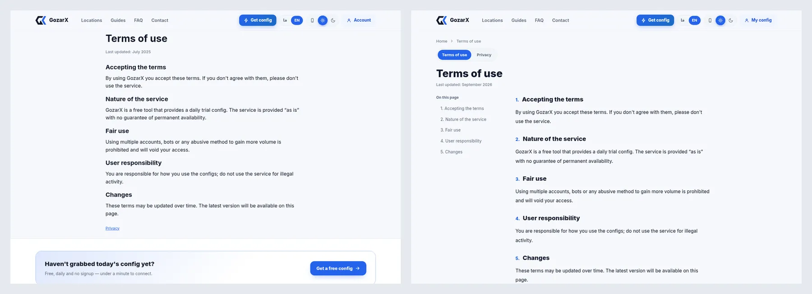
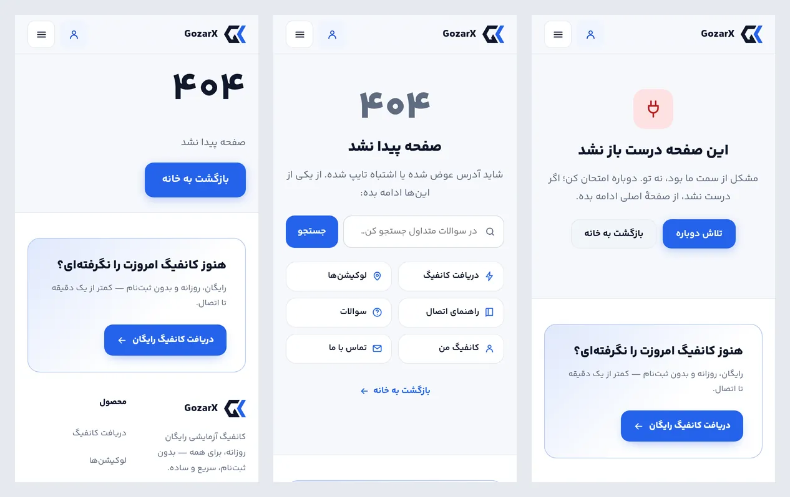
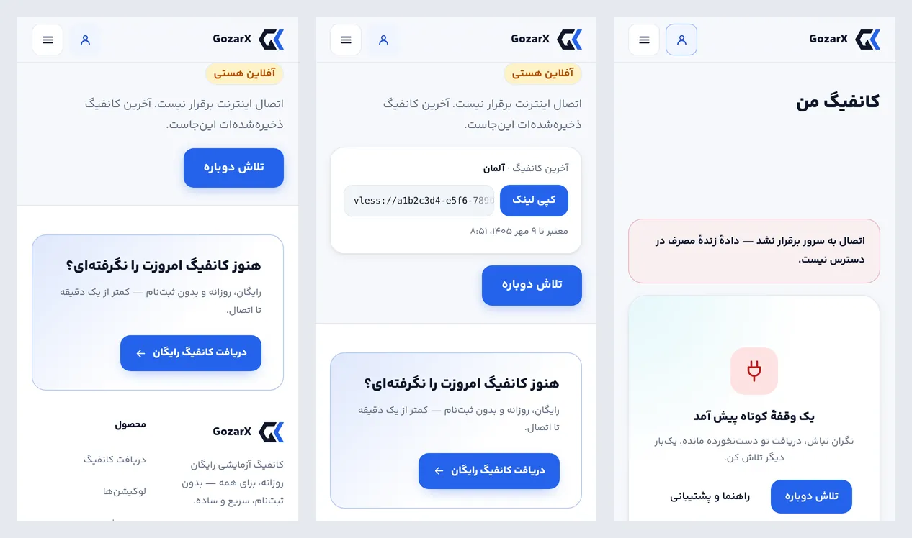
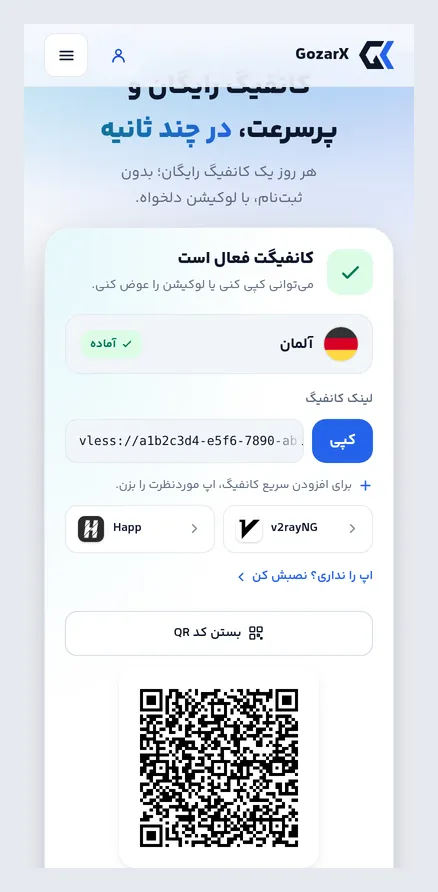
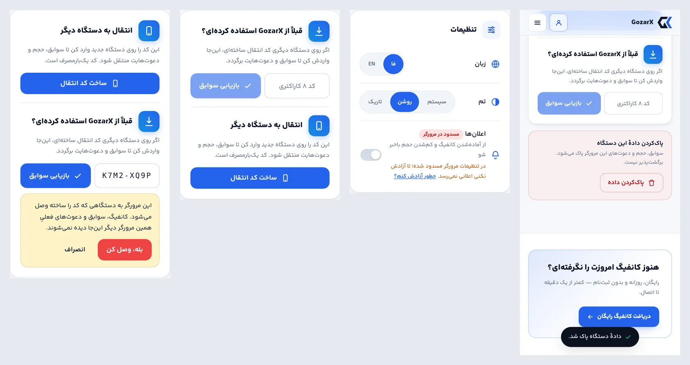
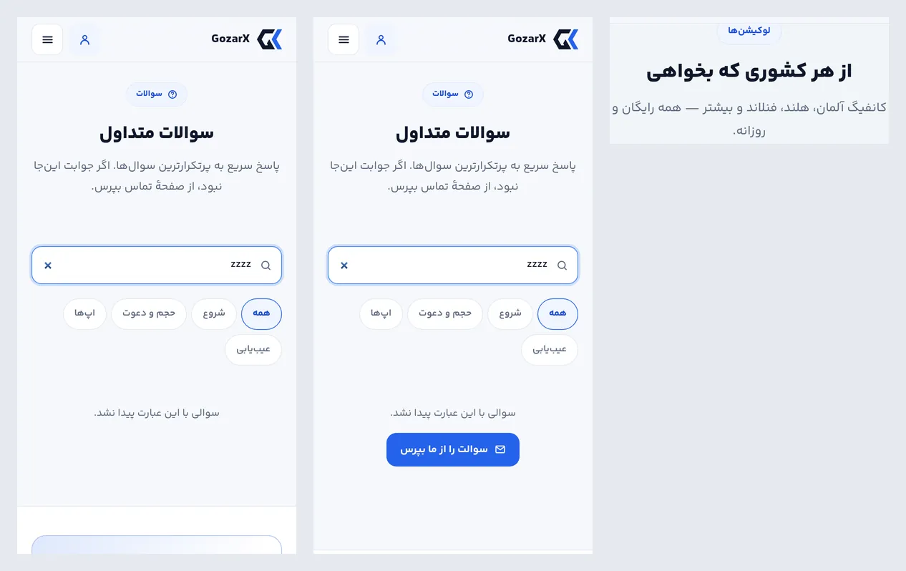

# فاز E — گزارش اجرا: محتوا، معماری اطلاعات، اعتماد

فاز E پلن [`05-fix-plan.md`](05-fix-plan.md) انجام شد. موضوع این فاز حرف‌هایی است که سایت به بازدیدکننده
می‌زند:
- صفحه‌ای که «حساب» ندارد، «حساب کاربری» نام داشت.
- دو نشانی یک متن را نشان می‌دادند.
- صفحهٔ حقوقی فهرست نداشت و تاریخی داشت که مال طرح اولیه بود.
- صفحهٔ آفلاین وعدهٔ کانفیگی را می‌داد که نشان نمی‌داد.
- متن‌ها کشورهایی را نام می‌بردند که شاید سرویس اصلاً ارائه نمی‌داد.
- QR وعده داده شده بود ولی وجود نداشت.

پذیرش با اسکریپت تازهٔ [`accept_e.py`](accept_e.py) روی سایت build‌شده و `mockapi.py` سنجیده شد.

## نتیجهٔ پذیرش (`accept_e.py`: ۱۱ از ۱۱)

| بررسی | قبل | بعد |
|---|---|---|
| D1 — نام صفحهٔ `/status` (۶ صفحه × ۲ زبان) | «حساب کاربری» / "Account" در هدر، منو، فوتر و عنوان صفحه؛ برگهٔ مرورگر عنوان صفحهٔ اصلی را داشت | «کانفیگ من» / "My config" همه‌جا؛ عنوان برگه «کانفیگ من — GozarX» |
| C-33 — `/about` و `/contact` | هر دو با H1 «دربارهٔ ما و تماس» و همان دو پاراگراف | دو صفحه: «دربارهٔ ما» با سه کارت (هدف، چطور رایگان می‌ماند، حریم خصوصی)؛ «تماس با ما» فقط برای تماس |
| C-34 — `/terms` و `/privacy` | ستون ساده، بدون فهرست و شماره؛ «تیر ۱۴۰۴» ثابت | مسیر صفحه، سوییچ دو صفحه، فهرست شماره‌دار که از ۹۰۰px چسبان است، بخش‌های شماره‌دار، «آخرین به‌روزرسانی: مهر ۱۴۰۵» |
| C-35 — ۴۰۴ | «۴۰۴» و یک دکمه | عنوان «صفحه پیدا نشد»، جستجو که با همان کلمه به FAQ می‌رود، شش مقصد پرکاربرد؛ کد HTTP همان ۴۰۴ |
| C-36 — یک منبع FAQ | تیزر صفحهٔ اصلی پنج سؤال کامپایل‌شده بود که ویرایش پنل به آن نمی‌رسید | پنج سؤال اول پنل، به ترتیب پنل؛ جستجوی بی‌نتیجه دکمهٔ «سوالت را از ما بپرس» دارد |
| C-53 — ادعاهای متن | «اوکراین، آلمان، آمریکا…»، «ده‌ها کشور… تا امارات»، «همه آنلاین و آماده‌اند»، «همهٔ کلاینت‌های محبوب» | فهرست زندهٔ اسکواد («آلمان، هلند، فنلاند و بیشتر») و اپ‌هایی که سایت واقعاً لینک می‌دهد |
| C-09 — QR | وعده در متن، بدون QR | دکمهٔ «کد QR» زیر دکمه‌های اپ. تصویر رندرشده با zxing رمزگشایی شد و همان لینک کانفیگ بود |
| C-35/C-67 — آفلاین | «آخرین کانفیگ ذخیره‌شده‌ات این‌جاست» و هیچ کانفیگی زیرش | آخرین کانفیگ با دکمهٔ کپی و زمان اعتبار، هم در `/offline` و هم در S8 ویجت وقتی `/status` جواب نمی‌دهد |
| C-17 — بازیابی با کد | بی‌هشدار، سوابق این مرورگر را جایگزین می‌کرد | مرورگری که داده دارد اول هشدار می‌بیند؛ مرورگر تازه بخش «قبلاً از GozarX استفاده کرده‌ای؟» را اول می‌بیند |
| C-20، C-21 | کلید اعلان بی‌توضیح غیرفعال بود؛ پاک‌کردن داده هیچ پیامی نداشت | کنار کلید علت و راه رفع آمده؛ بعد از پاک‌کردن، پیام «دادهٔ دستگاه پاک شد.» |

صفحهٔ خطای ۵۰۰ با یک مسیر موقتِ خطادهنده سنجیده شد، چون سایت مسیری که عمداً خطا بدهد ندارد. نتیجه:
HTTP ۵۰۰، H1 «این صفحه درست باز نشد»، دکمه‌های «تلاش دوباره» و «بازگشت به خانه»، و هدر و فوتر سایت
سر جایشان. مسیر موقت پیش از build نهایی حذف شد.

**پسرفت:**
- `accept_b.py` ۱۷ از ۱۷، `accept_c.py` ۳۷ از ۳۷ و `accept_d.py` ۱۲ از ۱۲.
- `accept_d` دو یافتهٔ تازهٔ ۴۴px گرفت که هر دو رفع شد: پیوند «خانه» در مسیر صفحهٔ حقوقی فقط ۲۳px عرض داشت، و دکمهٔ QR در انگلیسی ۴۳px ارتفاع.
- در هر ۹۱ رندر `audit.py`: خطای کنتراست ۰، سرریز ۰، رقم لاتین ۰ و بخش پنهان ۰.
- مثبت کاذب کنتراست روی گرادیان از ۱۱ به ۱۲ رسید. مورد تازه دکمهٔ نوار چسبان است، همان `.btn.cta` گرادیانی ۱۱ مورد دیگر، که این بار در رندر ۳۶۰ روی صفحه بود.
- CLS تغییری نکرد: صفحهٔ اول و لندینگ ۰، `/status` ۰٫۰۰۵ و ۰٫۰۰۳. یک پسرفت میانی پیدا و رفع شد: روی دسکتاپ CLS به ۰٫۰۱۱ رسیده بود، چون ردیف اعلان تا رسیدن `/config` پنهان می‌ماند و بعد ظاهر می‌شد.
- وزن صفحهٔ اول (غیرفشرده): CSS حدود ۵٫۶ کیلوبایت، HTML حدود ۵٫۶ و JS حدود ۹ کیلوبایت بیشتر شد، به‌علاوهٔ یک درخواست JS (مرز خطای `error.tsx`). کتابخانهٔ QR فقط با اولین باز شدن QR دانلود می‌شود.

## کارها، به تفکیک یافته

| شناسه | کار |
|---|---|
| C-16 (D1) | `nav_status`، `ft_status`، عنوان صفحه و کلیدهای chrome به «کانفیگ من» / "My config" تغییر کردند. «شناسهٔ حساب» شد «شناسهٔ دستگاه». `/status` حالا `generateMetadata` خودش را دارد (همچنان noindex). |
| C-33 | `/about` بازسازی شد: سرآغاز، سه کارت و ردیف «شاید جوابت این‌جا باشد». نثرش در پنل ویرایش‌پذیر است: گروه تازهٔ «صفحهٔ دربارهٔ ما» در «متن‌های سایت» با `about_lead`، `about_body`، `about_free_body` و `about_privacy_body`. `/contact` سرآغاز خودش را دارد و به «دربارهٔ ما» لینک می‌دهد. `ABOUT` درون‌کدی حذف شد. |
| C-34 | `LegalArticle` به شکل `vLegal` طرح بازسازی شد. تاریخ از یک ثابت ISO (`LEGAL_UPDATED_AT`) و با تقویم شمسی ساخته می‌شود. |
| C-35 | ۴۰۴: جستجو (فرم GET به `/faq?q=`، بدون JS هم کار می‌کند)، شش مقصد و «بازگشت به خانه». `error.tsx` تازه ساخته شد: `router.refresh()` + `reset()`، چون `reset` به‌تنهایی همان payload خراب را تکرار می‌کند. |
| C-35، C-67 | `lib/lastConfig` آخرین کانفیگی را که سرور تأیید کرده در `localStorage` نگه می‌دارد. کانفیگ زنده ذخیره می‌شود و «هیچ» (تمام‌شده، پاک‌شده، مسدود) آن را پاک می‌کند. سرورِ در دسترس‌نبود چیزی را تغییر نمی‌دهد. |
| C-36 | `HomeFaq` پنج ردیف اول `fetchFaqItems` را می‌گیرد و `faq1..faq5` درون‌کدی حذف شد. `/faq` حالا `faq_sub` پنل را می‌خواند: این کلید قابل‌ویرایش بود ولی هیچ صفحه‌ای نشانش نمی‌داد. `?q=` جستجو را پر می‌کند. حالت خالی به `/contact` می‌رود. |
| C-36 | چهار سؤال تازه در هر دو زبان: لوکیشنی که وصل نمی‌شود، اینترنت همراه، اطلاعاتی که نگه داشته می‌شود، و باز نشدن سایت. در seed، در fallback سایت و در مهاجرت `5b7e2c9d4a61`. |
| C-53 | `loc_sub` با توکن `{locs}` از فهرست زنده پر می‌شود. `/locations` فهرست را سمت سرور می‌خواند (`fetchPublicLocations`؛ دستگاه اختیاری است و خواندن بی‌کوکی هیچ دستگاهی نمی‌سازد). بدون فهرست، جمله بخش «این لوکیشن‌ها» را کنار می‌گذارد. `formatPlaces` در `lib/format` فهرست را می‌نویسد: «آلمان، هلند و فنلاند»، و بعد از حد «… و بیشتر». `how1_d` و `app_sub` بازنویسی شدند. |
| C-09 | `QrToggle`: کتابخانهٔ `uqr` (۰٫۱٫۳، MIT، بدون وابستگی) فقط با اولین باز شدن بارگذاری می‌شود. کد یک path SVG است، سیاه روی سفید در هر دو تم، با حاشیهٔ آرام چهار ماژولی. |
| C-17 | `TransferCard`: مرورگری که کانفیگ، سابقه یا دعوت دارد، پیش از بازیابی هشدار `role="alert"` با «بله، وصل کن» و «انصراف» می‌بیند. در مرورگر تازه ترتیب دو نیمه عوض می‌شود. |
| C-20 | ردیف اعلان علت را کنارش می‌گوید: «در مرورگر مسدود است» با «چطور آزادش کنم؟» (همان `BlockedHint` کارت جایزه‌ها که به `Overlay` منتقل شد)، «آیفون: فقط در وب‌اپ نصب‌شده» با «مراحل نصب»، یا «این مرورگر پشتیبانی نمی‌کند». اگر سرور کلید push نداشته باشد، ردیف نمایش داده نمی‌شود. |
| C-21 | بعد از پاک‌کردن داده، toast «دادهٔ دستگاه پاک شد.» در یک `role="status"` همیشه‌حاضر نمایش داده می‌شود. |
| C-18 | در فاز A بسته شده بود (خطای ساخت کد و رقم فارسی انقضا). اینجا فقط بررسی شد. |

## تصمیم‌ها و چیزهایی که حین کار پیدا شد

- **تصمیم‌های مالک در این فاز:**
  - بخش «چطور رایگان می‌ماند؟» خنثی نوشته شد: فقط می‌گوید دریافت پرداختی نمی‌خواهد و هر کانفیگ آزمایشی با مدت و حجم مشخص است. دربارهٔ منبع هزینه ادعایی نمی‌کند و متن از پنل قابل‌ویرایش است.
  - سؤال «یک کانفیگ روی چند دستگاه؟» اضافه نشد. اینکه پنل محدودیت HWID دارد یا نه از کد معلوم نیست.
- **متن حریم خصوصی کامل نبود.** بند «هویت دستگاه» از کوکی امضاشده و اثر انگشت مرورگر می‌گفت، ولی `identity.py` یک هش نمک‌دار از محدودهٔ شبکه (`/24` یا `/48`) هم نگه می‌دارد. این جمله اضافه شد. این تنها تغییر متن حقوقی بود و تاریخ هم به همین دلیل مهر ۱۴۰۵ شد.
- **گروهی که ویرایشگر پنل فهرست نکند، هرگز نمایش داده نمی‌شود.** مسیر `admin/site_content` ترتیب گروه‌ها را به‌صورت ثابت نوشته بود، پس کلیدهای گروه «about» قابل‌نوشتن بودند ولی هیچ فیلدی در پنل نشانشان نمی‌داد. تست موجود `test_lists_every_editable_key_with_its_default` این را گرفت.
- **مهاجرت FAQ فقط در جدولی می‌نویسد که از قبل ردیف دارد.** روی نصب تازه، مهاجرت‌ها پیش از seeder اجرا می‌شوند و جدول هنوز خالی است. اگر مهاجرت آن‌جا ردیف می‌ساخت، seeder (با `has_any`) پیش‌فرض‌ها را نمی‌نوشت و نصب تازه فقط همین چهار سؤال را داشت. هر سؤال بعد از آخرین سؤال همان زبان می‌نشیند و `ON CONFLICT (locale, question)` سؤالی را که اپراتور خودش نوشته دست نمی‌زند. یک تست ردیف‌های مهاجرت را با seed برابر نگه می‌دارد. روی Postgres آزمایشی سنجیده شد: جدول seed‌شده ۱۶ به ۲۴ ردیف رسید و downgrade دوباره ۱۶ کرد، جدول خالی خالی ماند، ردیف `loc_sub` با متن قدیمی خالی شد و ردیف ویرایش‌شده دست نخورد.
- **صفحهٔ آفلاین با اسکریپت درون‌خطی کار می‌کند، نه کامپوننت کلاینت.** service worker فقط HTML این صفحه را کش می‌کند، نه تکه‌های JS آن را، پس در حالت آفلاین ممکن است کامپوننت اصلاً بارگذاری نشود. اسکریپت یک slot مات (`dangerouslySetInnerHTML`) را پر می‌کند. اگر hydration انجام شود، React فرزندان اضافهٔ یک عنصر معمولی را حذف می‌کند، ولی محتوای slot مات را نگه می‌دارد. متن فقط با `textContent` وارد می‌شود و لینک باید شکل URL داشته باشد. کش SW به `v3` رفت تا نسخهٔ تازهٔ `/offline` جایگزین نسخهٔ کش‌شده شود.
- **S8 هم کانفیگ ذخیره‌شده را نشان می‌دهد.** در حالت آفلاین، SW برای `/` و `/status` پوستهٔ کش‌شدهٔ خودشان را می‌دهد، نه `/offline`. وب‌اپ نصب‌شده با `/` باز می‌شود، و آن‌جا بود که کانفیگ لازم بود.
- **ترتیب ماه و سال در ICU فارسی** «۱۴۰۵ مهر» است. تاریخ از `formatToParts` با ترتیب «مهر ۱۴۰۵» ساخته می‌شود.
- **شبیه‌سازی آفلاین Playwright** فقط اولین fetch کارگر سرویس بعد از `set_offline` را پوشش می‌دهد. ناوبری دوم به سرور واقعی رسید و صفحهٔ ۴۰۴ آمد، نه `/offline`. برای همین `accept_e` هر حالت آفلاین را در یک context تازه می‌سنجد.
- **`npm audit`** پنج هشدار دارد (next، postcss، sharp، nanoid، baseline-browser-mapping) که همه پیش از این فاز هم بودند. `uqr` هیچ هشداری اضافه نکرد. هشدار «critical» مربوط به next است و ارتقای Next کار یک PR جداست.

## شاهدها

| | |
|---|---|
|  | «دربارهٔ ما» قبل و بعد؛ «تماس» قبل و بعد. پیش‌تر هر دو یک H1 و یک متن داشتند |
|  | قوانین استفاده روی دسکتاپ: ستون ساده ← فهرست شماره‌دار چسبان، سوییچ و تاریخ |
|  | ۴۰۴ قبل و بعد؛ صفحهٔ خطای تازه |
|  | آفلاین: وعدهٔ بی‌کانفیگ ← کارت آخرین کانفیگ؛ S8 ویجت با همان کانفیگ |
|  | «کد QR» زیر دکمه‌های اپ |
|  | هشدار پیش از بازیابی؛ مرورگر تازه «بازیابی» را اول می‌بیند؛ علت کلید اعلان؛ toast بعد از پاک‌کردن |
|  | جستجوی بی‌نتیجه قبل و بعد («بپرس»)؛ جملهٔ لوکیشن‌های صفحهٔ اول از فهرست زنده |

## استقرار

- یک مهاجرت داده دارد: `5b7e2c9d4a61`. چهار سؤال FAQ در هر زبان به FAQ seed‌شده اضافه می‌کند و ردیف‌های `site_copy_loc_sub` و `site_copy_app_sub` را که هنوز دقیقاً متن پیش‌فرض قدیمی را دارند خالی می‌کند. هنگام بوت با `alembic upgrade head` اجرا می‌شود.
- یک وابستگی npm تازه دارد: `uqr` (نسخهٔ ثابت ۰٫۱٫۳، در `package-lock.json`). `npm ci` داخل Dockerfile سایت آن را نصب می‌کند.
- کش SW روی `v3` است. مرورگرها در بازدید بعدی نسخهٔ تازهٔ صفحهٔ آفلاین را می‌گیرند.
- متغیر محیطی تازه‌ای ندارد و فرمان‌های معمول استقرار (CLAUDE.md) کافی است.

## بیرون از این فاز (برای مالک)

- **متن حریم خصوصی** دربارهٔ این‌ها چیزی نمی‌گوید:
  - راه پاسخ اختیاری فرم تماس، که ذخیره می‌شود؛
  - اشتراک اعلان، اگر فعال شود؛
  - Cloudflare، که پروکسی و Turnstile را فراهم می‌کند.

  تصمیم دربارهٔ متن حقوقی با مالک است.
- **بخش «چطور رایگان می‌ماند؟»** را از پنل (متن‌های سایت ← «صفحهٔ دربارهٔ ما») با واقعیت کسب‌وکار کامل کنید.
- **تصویر مراحل راهنماها** هنوز منتظر عکس واقعی از Happ است (فاز C).
- **ارتقای Next.js** برای هشدارهای `npm audit` باید در یک PR جدا انجام شود.
