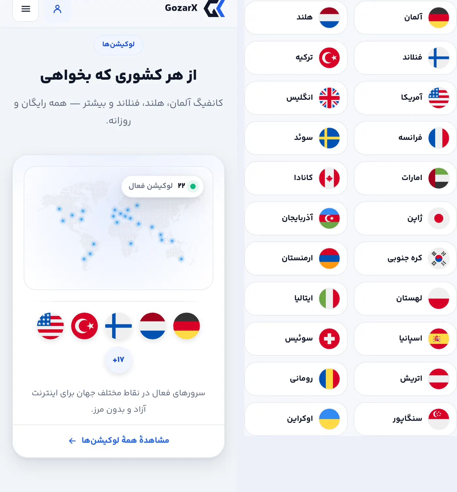
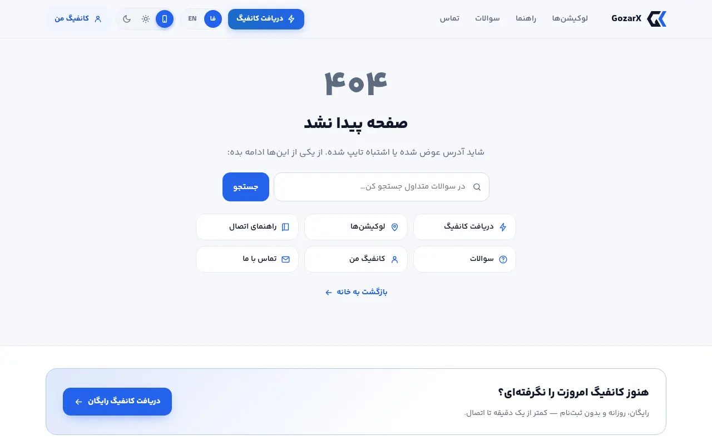
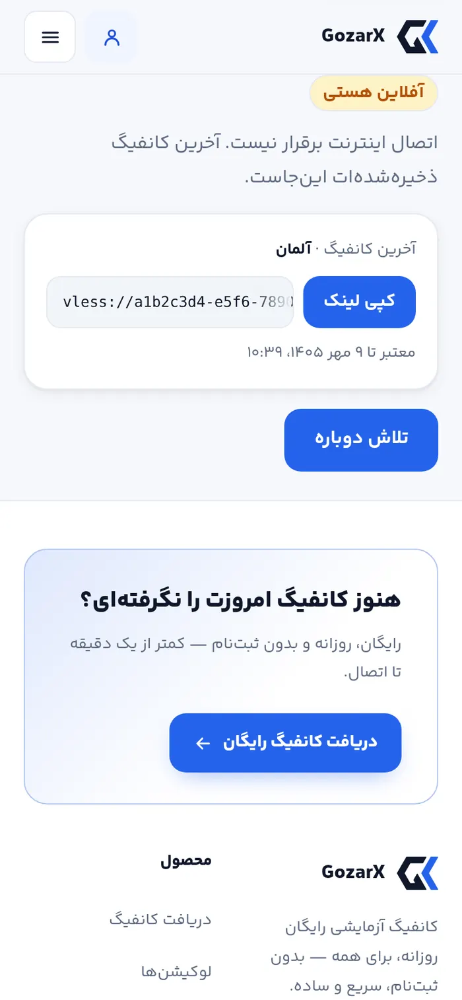

# فاز F — گزارش اجرا: کارایی و معماری سئو

فاز F پلن [`05-fix-plan.md`](05-fix-plan.md) انجام شد. این فاز تغییری نیست که بازدیدکننده ببیند، بلکه در
شیوهٔ رسیدن صفحه به اوست:
- هر بازدید، کل درخت React را از نو روی سرور می‌ساخت. `cookies()` در layout همهٔ صفحه‌ها را داینامیک کرده بود.
- دیکشنری کامل هر دو زبان، با ۲۴۴ کلیدی که هیچ صفحه‌ای نمی‌خواند، در JavaScript اولین بازدید بود.
- یک فایل CSS یکپارچهٔ ۱۱۳ کیلوبایتی، با بخش‌های مرده و قاعده‌های تکراری، جلوی رندر هر صفحه را می‌گرفت.
- فهرست لوکیشن‌ها در HTML نبود.
- هر اشتراک‌گذاری آیکون مربعی ۵۱۲ پیکسلی را نشان می‌داد.
- صفحهٔ آفلاین بدون CSS باز می‌شد.

پذیرش با اسکریپت تازهٔ [`accept_f.py`](accept_f.py) روی سایت build‌شده و `mockapi.py` سنجیده شد.

## نتیجهٔ پذیرش (`accept_f.py`: ۱۸ از ۱۹)

| بررسی | قبل | بعد |
|---|---|---|
| C-61 — صفحهٔ استاتیک | همهٔ مسیرها `ƒ` (هر بازدید یک رندر) | همه `●`؛ درخواست دوم `x-nextjs-cache: HIT` روی `/`، `/l/*`، `/guides/*`، `/faq` و `/locations` |
| D3 — یک نشانی، زبان با درخواست | زبان از کوکی و `Accept-Language` در layout خوانده می‌شد و صفحه را داینامیک می‌کرد | `proxy.ts` همان ترتیب را اجرا می‌کند (کوکی ← `Accept-Language` ← فارسی) و درخواست را به درخت استاتیک همان زبان rewrite می‌کند. خزنده فارسی می‌گیرد. `/fa/…` و `/en/…` با ۳۰۸ به نشانی اصلی می‌روند و hreflang وجود ندارد |
| کش مشترک | `private, no-store` (صفحه داینامیک بود) | `private, no-cache` با ETag و پاسخ ۳۰۴. یک نشانی دو زبان دارد، پس هیچ کش مشترکی نباید آن را نگه دارد |
| ۴۰۴ | مسیر ناشناخته کامل روی سرور رندر می‌شد | همچنان کامل روی سرور، با هدر، فوتر و زبان درست (`global-not-found`) |
| C-56 — دیکشنری در bundle | هر دو زبان، ۴۹۱ کلید طرح + ۱۶۳ کلید chrome (~۲۱ کیلوبایت gzip) | JavaScript هیچ رشتهٔ کپی ندارد: کپی یک زبان، با override پنل، در payload صفحه می‌آید. کلیدهایی که خوانده نمی‌شدند حذف شدند: ۲۴۴ کلید طرح و ۷۵ کلید chrome در هر زبان |
| C-59 — CSS صفحهٔ اصلی | ۲۰٫۶ کیلوبایت gzip (۱۱۲٫۷ خام)، یک فایل برای همه | **۹٫۴ کیلوبایت gzip** (۴۷٫۱ خام). بقیه در `status.css`، `pages.css` و `claimed.css` است که فقط صفحهٔ مربوط بارگذاری می‌کند |
| JS صفحهٔ اصلی | ۱۹۱٫۸ کیلوبایت gzip | **۱۶۷٫۴ کیلوبایت gzip** — هدف ۱۶۰ بود؛ پایین‌تر را ببینید |
| prefetch | ۱ درخواست RSC (۴٫۵ کیلوبایت) | ۰. بدون تنظیم، صفحه‌های استاتیک کل مسیر را prefetch می‌کردند: ۱۲ درخواست، حدود ۳۶ کیلوبایت |
| C-65 — `/locations` | جدول پرچم‌ها فقط بعد از fetch مرورگر | ۲۲ پیوند لوکیشن در HTML |
| C-66 — تصویر اشتراک | آیکون مربعی ۵۱۲ | کارت ۱۲۰۰×۶۳۰ سایت، و برای هر لندینگِ لوکیشن کارت با پرچم همان کشور؛ `summary_large_image`. خط `Host` از `robots.txt` حذف شد |
| C-68 — manifest | فقط انگلیسی، `purpose: "any maskable"` ترکیبی، زمینهٔ تیره برای همه، بدون `id`/`lang` | دو manifest (فارسی و انگلیسی) با `id` مشترک، `lang`/`dir`/توضیح هر زبان، آیکون جدا برای `any` (گوشهٔ گرد) و `maskable`، زمینهٔ تم روشن پیش‌فرض |
| C-63 — پرچم‌های بالای فولد | `loading="lazy"` روی همه | دو ردیف اول انتخاب‌گر، پرچم کانفیگ تحویل‌شده و هشت خانهٔ اول `/locations` بدون lazy |
| C-67 — آفلاین | فقط HTML کش می‌شد، پس صفحهٔ آفلاین بی‌استایل بود | SW هنگام نصب CSS و JS و فونت پوسته را هم کش می‌کند، و هر فایل هش‌دار بارگذاری‌شده را هم (سقف ۸۰ فایل). `/offline` در حالت آفلاین با فونت و رنگ سایت و آخرین کانفیگ باز شد |
| تم | از کوکی روی سرور | یک اسکریپت درون‌خطی کوچک، پیش از رنگ‌آمیزی اولین فرزند `#app`، `data-theme` را می‌گذارد. در حالت تیره بدون چشمک و بدون خطای hydration |

**تنها بررسی ناموفق: JS صفحهٔ اصلی ۱۶۷٫۴ کیلوبایت است و هدف ۱۶۰ بود.** کد خود سایت از حدود ۴۹ به حدود ۲۳
کیلوبایت رسید:
- دیکشنری از bundle بیرون رفت.
- نماهای بعد از دریافت جدا شدند.
- سه بخش صفحهٔ اصلی و فوتر روی سرور رندر می‌شوند.

حدود ۱۴۴ کیلوبایت باقی‌مانده runtime خود Next 16.2 و React 19 است، یعنی به‌تنهایی ۹۰٪ بودجه. رسیدن به ۱۶۰ یعنی
حذف بیشتر کد باقی‌ماندهٔ ویجت و منوها، که ارزش خطرش را نداشت. ارتقای Next که برای هشدارهای `npm audit` هم لازم است،
شاید runtime را کوچک‌تر کند.

**پسرفت:**
- `accept_b.py` ۱۷ از ۱۷، `accept_c.py` ۳۷ از ۳۷، `accept_d.py` ۱۲ از ۱۲ و `accept_e.py` ۱۱ از ۱۱.
- در هر ۹۱ رندر `audit.py`: خطای کنتراست ۰، سرریز ۰، رقم لاتین ۰ و بخش پنهان ۰. CLS در هیچ حالتی تغییر نکرد.
- **مقایسهٔ پیکسلی** همهٔ ۹۱ تصویر build نهایی با تصویرهای پایان فاز E (همان main):
  - تنها تفاوت عمدی دکمهٔ «تلاش دوباره» در `/offline` است که حالا `.btn.lg` خود طرح است (C-62).
  - در `home-fa-active-m390` پرچم‌های بخش لوکیشن حالا در تصویر هستند. فهرست در HTML است و پرچم‌ها پیش از عکس
    بارگذاری می‌شوند. قبلاً فهرست بعد از fetch مرورگر می‌آمد و در لحظهٔ عکس دایره‌ها خالی بودند.
  - دو مورد دیگر زمان‌بندی نوار چسبان بود، یکی در هر اجرا. تصویر build نهایی سه بار دوباره گرفته شد و هر سه بار
    عیناً با پایه یکی بود.

## وزن اولین بازدید

گوشی ۳۹۰×۸۴۴ با کش خالی. هر پاسخ با gzip سطح ۵ (همان `gzip_comp_level` nginx) فشرده شده است. پیش‌نمایش prefetch حساب نشده.

| صفحه | JS قبل ← بعد | CSS قبل ← بعد | HTML قبل ← بعد |
|---|---|---|---|
| `/` | ۱۹۱٫۸ ← ۱۶۷٫۴ | ۲۰٫۶ ← ۹٫۴ | ۱۱٫۶ ← ۲۰٫۹ |
| `/status` | ۱۹۴٫۲ ← ۱۷۱٫۶ | ۲۰٫۶ ← ۱۳٫۴ | ۸٫۰ ← ۱۴٫۹ |
| `/l/vpn-germany` | ۱۸۹٫۷ ← ۱۶۶٫۱ | ۲۰٫۶ ← ۱۳٫۳ | ۸٫۸ ← ۱۶٫۵ |
| `/faq` | ۱۷۷٫۵ ← ۱۵۸٫۱ | ۲۰٫۶ ← ۱۳٫۳ | ۸٫۷ ← ۱۶٫۳ |

- HTML بزرگ‌تر شد، چون دو چیز حالا در خود صفحه است:
  - کپی یک زبان، که قبلاً کپی هر دو زبان در JS بود؛
  - فهرست لوکیشن‌ها، مقدار جایزه‌ها و آمار، که قبلاً سمت مرورگر پر می‌شد.
- با این حال مجموع JS و CSS و HTML در هر چهار صفحه کم شد: صفحهٔ اصلی ۲۲۴ ← ۱۹۸، `/status` ۲۲۳ ← ۲۰۰، لندینگ ۲۱۹ ← ۱۹۶ و `/faq` ۲۰۷ ← ۱۸۸ کیلوبایت. این بدون ۳۶ کیلوبایت prefetch است که صفحهٔ استاتیکِ بی‌تنظیم اضافه می‌کرد.
- JS صفحه‌هایی که ویجت ندارند زیر بودجه است (`/faq` ۱۵۸٫۱، `/locations` ۱۵۹٫۱). صفحه‌های ویجت‌دار ۱۶۶ تا ۱۷۲ هستند.
- بازدید تکراری HTML را با ETag اعتبارسنجی می‌کند. تا وقتی صفحه در کش سرور تغییر نکرده، پاسخ ۳۰۴ است.

## کارها، به تفکیک یافته

| شناسه | کار |
|---|---|
| C-61، D3 | همهٔ صفحه‌ها به `app/[lang]/…` رفتند. `proxy.ts` (جانشین middleware در Next 16) زبان را انتخاب و rewrite می‌کند. صفحه‌ها زبان را از `params` می‌خوانند (`localeOf`)، نه از درخواست. `generateStaticParams` خالی است: هیچ صفحه‌ای هنگام build (که backend ندارد) ساخته نمی‌شود و هر صفحه با اولین بازدید ساخته و کش می‌شود. `revalidate = 300` همان پنج دقیقهٔ fetch‌هاست. `?loc=` و `?q=` در مرورگر خوانده می‌شوند (`QueryParam` در Suspense خودش)، چون خواندنشان روی سرور صفحه را دوباره داینامیک می‌کرد. عوض کردن زبان حالا یک بارگذاری کامل است: هر زبان root layout جدای خودش را دارد. |
| C-64 | تصمیم D3 ثبت شد (CLAUDE.md): سئو فقط فارسی است. یک نشانی برای هر صفحه، بدون `/en/` و بدون hreflang. انگلیسی ترجیح نمایش است، نه سایت دوم. به صفحهٔ انگلیسی هرگز `noindex` داده نمی‌شود، چون نشانی‌اش همان نشانی صفحهٔ فارسی است. |
| C-56 | `lib/i18n` فقط ابزار زبان است. دیکشنری‌ها در `lib/copy` هستند و فقط کد سرور آن‌ها را import می‌کند. `clientCopy` کپی یک زبان را، با override پنل، حل می‌کند و `CopyProvider` در layout آن را به `useT()` کامپوننت‌های مرورگر می‌رساند. نتیجهٔ جانبی: override پنل حالا به همهٔ کامپوننت‌های کلاینت می‌رسد، نه فقط به آن‌هایی که صفحهٔ اصلی `copy` را به‌شان می‌داد. |
| C-56 | کلید حذف‌شده یعنی کلیدی که هیچ رشته‌ای در کد آن را نمی‌خواند، پیشوند پویای `notice_` هم ندارد و در فهرست قابل‌ویرایش پنل (`site_copy_keys.py`) هم نیست. |
| C-59 | CSS با **اندازه‌گیری** جدا شد: برای هر قاعده در هر حالت ۱۰۷ رندر، چه قاعده‌ای به چه عنصری در چه صفحه‌ای می‌خورد.  • `base.css`: هر قاعده‌ای که یک حالت صفحهٔ اصلی رسمش می‌کند؛ همه‌جا بارگذاری می‌شود.  • `claimed.css`: نماهای بعد از دریافت؛ با ماژول تنبل همان نماها می‌آید.  • `status.css`: فقط `/status`.  • `pages.css`: بقیهٔ صفحه‌ها.  ۲۰۷ قاعده که به هیچ عنصری نخوردند و کلاسی دارند که هیچ کامپوننتی نمی‌گذارد حذف شدند: گالری، devbar و toolbar طرح، بلاگ، gauge، صفحهٔ قدیمی `/rewards`، نوار زبان و لایهٔ compat. ۱۰۱ declaration هم حذف شد که قاعده‌ای بعدی با همان selector در همان media آن را کامل می‌پوشاند. |
| C-59 | ترتیب cascade بررسی شد. هر قاعده‌ای که به فایلِ دیرتر رفت و پیش‌تر یک قاعدهٔ `base` با همان specificity و خانوادهٔ property (مثلاً `padding` در برابر `padding-inline`) رویش می‌نشست، پیدا شد. چهار مورد بود و هر چهار کنار هم در فایل دیرتر قرار گرفتند: `.app-get`، `.dl-alt`، `.mini-seg button` و `.bar.warn>i`. |
| C-58 | رنگ‌های تم یک تعریف دارند: `styles/tokens.mjs`. `npm run tokens` چهار بلوک را در `styles/tokens.css` می‌نویسد. `npm run build` (و در نتیجه Docker) با فایل کهنه build نمی‌کند، و کلیدی که فقط در یک تم باشد را رد می‌کند. |
| C-62 | آخرین جاهایی که `.btn-primary`، `.btn-ghost`، `.card-pad` و `.mt-*` داشتند (خطا، آفلاین، راهنما) به `.btn`، `.btn.secondary`، `.btn.lg` و کلاس خودشان رفتند و آن لایه حذف شد. `CopyField.tsx` قدیمی بی‌استفاده بود و حذف شد. |
| JS | ویجت نماهای بعد از دریافت را از `widget/after` بارگذاری می‌کند: فیلد کپی، دکمه‌های اپ، QR، مصرف، شمارنده، ماموریت‌ها و احیا. زمان بارگذاری:  • همراه درخواست دریافت، پس خروجی دریافت منتظرش نمی‌ماند؛  • در مرورگری که کانفیگی ذخیره کرده، از همان ابتدا.  تا رسیدن ماژول، همان اسکلتون بارگذاری `/status` نمایش داده می‌شود. `HomeMissions`، `HomeStats`، `HomeLocations` و فوتر (به‌جز نوار وضعیت و دکمه‌های زبان) کامپوننت سرور شدند. |
| prefetch | `components/Link` همان `next/link` است با `prefetch={false}`. |
| C-65 | `LocationsGrid` با فهرستی که سرور خوانده رندر می‌شود و fetch مرورگر آن را تازه می‌کند. بخش لوکیشن صفحهٔ اصلی هم همین‌طور. |
| C-66 | `/og/site.png` و `/og/<slug>.png` با `next/og` ساخته می‌شوند، خارج از `[lang]`. کارت فقط لاتین است، چون Satori حروف فارسی را به هم نمی‌چسباند. لندینگِ بدون لوکیشن کارت سایت را می‌گیرد. |
| C-67 | SW `v4`: هنگام نصب، پوسته‌ها (`/`، `/status`، `/offline`) و CSS/JS/فونتی که در HTML‌شان نام برده شده کش می‌شوند. در زمان اجرا، فایل‌های هش‌دار `/_next/static` از کش سرو می‌شوند و در راه ذخیره. فونت از کش سرو و پشت صحنه تازه می‌شود. |
| C-68 | دو manifest با `id: "/"` مشترک؛ layout برای هر زبان manifest خودش را لینک می‌دهد. آیکون‌های `any` (`icon-any-*.png`، گوشهٔ گرد) از همان تصویرهای `maskable` ساخته شدند. طرح در منطقهٔ امن ۸۰٪ است. |

## تصمیم‌ها و چیزهایی که حین کار پیدا شد

- **صفحهٔ استاتیک، prefetch کامل می‌کند.** در صفحهٔ داینامیک، `<Link>` فقط تا مرز loading را prefetch می‌کرد (۴٫۵ کیلوبایت). در صفحهٔ استاتیک کل مسیر prefetch می‌شود: payload سرور، payload مشترک layout که کپی صفحه را هم دارد، و JavaScript همان مسیر.
  - هر پیوندی که تا ۲۰۰ پیکسل زیر صفحه باشد prefetch می‌شد. پیوندهای منوی موبایلِ بسته هم، که زیر لبهٔ صفحه منتظرند، شامل همین بودند.
  - نتیجه در اولین بازدید: ۱۲ درخواست و حدود ۳۶ کیلوبایت، با اینترنتی که بازدیدکننده پولش را می‌دهد.
  - `prefetch={false}` روی همهٔ پیوندها آن را حذف کرد. هر کلیک یک fetch از صفحهٔ کش‌شده است، که از رندر هر بازدید در main سریع‌تر است.
- **catch-all نمی‌تواند ۴۰۴ را روی سرور رندر کند.** `notFound()` در یک صفحهٔ داینامیک بدون مرز Suspense، روی سرور به پوستهٔ خطای Next (`<html id="__next_error__">`) ختم می‌شود و محتوا را مرورگر می‌سازد. main هم برای `/l/<slug-ناشناخته>` همین رفتار را داشت (با build main در worktree سنجیده شد). ولی main مسیر ناشناخته را کامل روی سرور رندر می‌کرد، چون `app/not-found.tsx` ریشه داشت.
  - با `[lang]` دیگر layout ریشه‌ای وجود ندارد. `app/global-not-found.tsx` (با `experimental.globalNotFound`) همان سند را با `SiteDocument` مشترک می‌کشد. زبان را مثل proxy انتخاب می‌کند و کش نمی‌شود.
  - صفحهٔ ۴۰۴ هیچ CSS خودش را نمی‌تواند بارگذاری کند. import در `not-found.tsx`، فایل `pages.css` را به **همهٔ** صفحه‌ها اضافه کرد (CSS صفحهٔ اصلی ۹٫۴ ← ۱۳٫۳)، چون مرز not-found بخشی از درخت هر صفحه است. پس قاب ۴۰۴ و مرز خطا در `base.css` هستند.
- **کش ISR روی دیسک مرز ندارد.** هر slug ساختگی (`/l/<هرچه>`) حدود ۱۰۰ کیلوبایت ۴۰۴ کش‌شده روی دیسک می‌گذاشت و هیچ چیز پاکش نمی‌کرد. `experimental.isrFlushToDisk: false` صفحه‌ها را فقط در کش حافظه (LRU با سقف ۵۰ مگابایت) نگه می‌دارد. بعد از هر restart، اولین بازدید هر صفحه آن را دوباره می‌سازد.
- **Cache-Control را فقط `next.config` می‌تواند عوض کند.** Next برای ISR `s-maxage=300` می‌فرستد، و proxy نمی‌تواند آن را بازنویسی کند (Next سرآیند `Vary` خودش را هم روی آن می‌نویسد). ولی Next سرآیندی را که `headers()` گذاشته دست نمی‌زند، پس `private, no-cache` آن‌جا گذاشته شد.
- **`useSearchParams` هرچه بالایش باشد را فقط-کلاینت می‌کند،** تا نزدیک‌ترین مرز Suspense. `QueryParam` یک کامپوننت تهی است با Suspense خودش. بدون این، ویجت و فهرست FAQ در HTML رندر نمی‌شدند.
- **کپی در payload صفحه، نه در bundle.** راه دیگر این بود که کپی هر زبان یک chunk جدا باشد، ولی Next همهٔ client componentهایی را که layout import می‌کند در entry مسیر می‌گذارد، و در عمل هر دو chunk بارگذاری می‌شد.
  - هزینهٔ راه انتخاب‌شده حدود ۷ کیلوبایت HTML در هر بارگذاری کامل است. در ازایش ۲۱ کیلوبایت JavaScript و parse آن در اولین بازدید حذف شد.
  - در بازدید تکراری، ETag همان HTML را ۳۰۴ می‌کند تا وقتی صفحه عوض نشده باشد.
- **ماژول تنبل، CSS خودش را هم می‌آورد.** Turbopack پیش از resolve کردن `import()` فایل `claimed.css` را بارگذاری می‌کند. با MutationObserver سنجیده شد: در اولین فریمی که S3 یا S4 ظاهر می‌شود، فیلد کپی `display: flex` است و بی‌استایل دیده نمی‌شود.
- **`localeOf` برای `lang` نامعتبر هنوز `notFound()` می‌دهد،** ولی proxy هرگز چنین درخواستی نمی‌سازد: هر پیشوند دیگر (`/de/x`) به `/fa/de/x` rewrite می‌شود و به ۴۰۴ سراسری می‌رسد.

## شاهدها

| | |
|---|---|
|  | کارت اشتراک سایت و کارت لندینگ «کانفیگ آلمان»، ۱۲۰۰×۶۳۰ |
|  | با JavaScript خاموش: بخش لوکیشن صفحهٔ اول و جدول `/locations`، هر دو از HTML |
|  | مسیر ناشناخته با JavaScript خاموش: ۴۰۴ کامل از سرور |
|  | `/offline` در حالت آفلاین، از کش SW، با استایل و آخرین کانفیگ |

## استقرار

- مهاجرت، وابستگی npm تازه و متغیر محیطی تازه ندارد. پیکربندی nginx هم عوض نشده.
- فرمان‌های معمول استقرار (CLAUDE.md) کافی است و `install.sh --tls-only` لازم نیست.
- بعد از استقرار، اولین بازدید هر صفحه آن را می‌سازد و از آن به بعد از کش سرو می‌شود. کش در حافظه است و هر restart کانتینر سایت آن را خالی می‌کند.
- کش SW روی `v4` است. مرورگرها در بازدید بعدی نسخهٔ تازه را نصب می‌کنند و CSS/JS پوسته را هم کش می‌کنند.
- `npm run build` حالا اول `node scripts/tokens.mjs --check` را اجرا می‌کند. Dockerfile سایت همین فرمان را اجرا می‌کند.

## بیرون از این فاز (برای مالک)

- **بودجهٔ JS (۱۶۰ کیلوبایت)** با runtime فعلی Next در دسترس نیست. ارتقای Next.js (که برای هشدارهای `npm audit` هم لازم است) را در PR جدا انجام دهید و بعدش `accept_f.py` را دوباره اجرا کنید.
- **۴۰۴ داخل یک صفحه** (مثلاً `/l/<slug-ناشناخته>`) مثل main در HTML پوستهٔ خطاست و محتوایش را مرورگر می‌سازد. کد وضعیت ۴۰۴ و `noindex` درست است. رفعش باید در خود Next باشد.
- **کارت اشتراک** فقط متن لاتین دارد. کارت فارسی به یک موتور رندر دیگر نیاز دارد، چون Satori حروف فارسی را متصل نمی‌کند.
